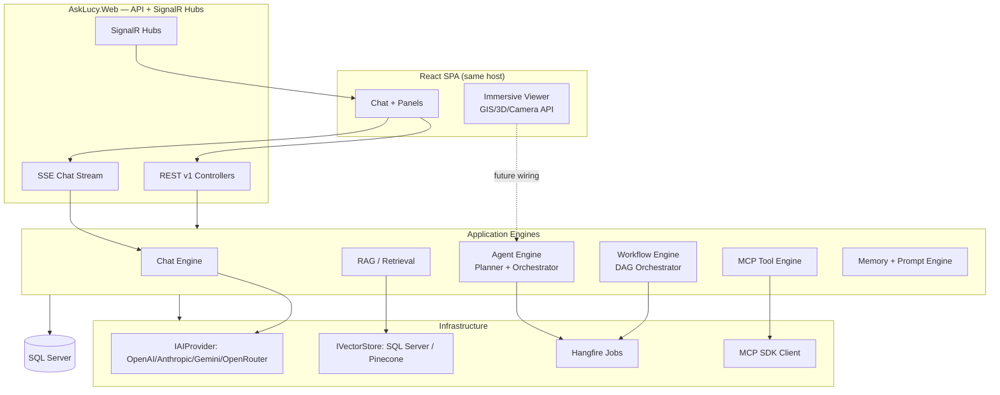
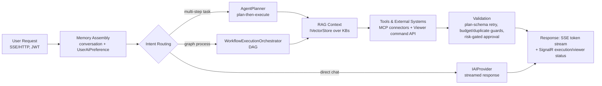

# Ask Lucy — Agentic AI Engine Specification

> **Audience:** engineers integrating other platforms/tools with Ask Lucy.
> **Status:** authoritative technical definition, reflects the current implemented codebase (not aspirational roadmap).

---

## 1. Purpose & Role

Ask Lucy is the **Agentic AI Engine** whose mission is to drive AI-assisted urban design and planning, with an initial focus on **parks**. It is not a general-purpose chatbot bolted onto a UI — it is the reasoning, retrieval, and orchestration layer that plans and executes multi-step design/analysis work and drives a real spatial workspace.

That spatial workspace already exists in-code: `specs/027-immersive-viewer-platform` is a Three.js-based extensible 2D/3D viewer (GIS/map layer, 3D model layer, camera/navigation, selection/overlays) with a **programmatic command/event API** explicitly built so that "later Ask Lucy AI-agent features can call" it — agent wiring to that API is not yet built, but the surface is. `specs/028-ai-floating-panels` extends this with an AI-to-UI floating panel framework. Ask Lucy's job is to be the intelligence that drives these surfaces: understanding a planning request, retrieving relevant design/regulatory knowledge, executing multi-step agent or workflow logic, and issuing viewer commands and UI panels as output — not just text.

**Ask Lucy owns:** conversational AI, RAG over planning/design knowledge, agent planning & execution, workflow/tool orchestration, MCP-based tool/data connectivity, prompt & memory management, driving the immersive viewer, and its own user identity.

**Ask Lucy does not own:** billing/commerce, an external product catalog, or any responsibility belonging to a not-yet-defined surrounding platform. This document is deliberately platform-agnostic on that front — no specific external system is assumed as an integration partner.

---

## 2. Core Capabilities

- **Multi-provider chat** — `IAIProvider` abstraction resolved via keyed DI (`AiProviderResolver`); concrete providers: OpenAI, Anthropic, Google Gemini, OpenRouter. Per-user default provider/model/params via `UserAiPreference`. Responses stream to the client over SSE.
- **RAG over planning/design knowledge** — ingest → 8 pluggable chunking strategies (fixed, recursive, paragraph, sentence, markdown, heading, table, semantic) → embeddings (OpenAI or local ONNX) → dual vector store behind `IVectorStore` (SQL Server native `vector` column, brute-force cosine scan, or Pinecone per knowledge base) → semantic retrieval scoped per knowledge base.
- **Agent framework** — `AgentPlanner` produces a single upfront JSON step plan (plan-then-execute, one corrective retry on invalid JSON); `AgentExecutionOrchestrator` walks the plan step-by-step, is resumable, runs on Hangfire, and pauses for human approval on High/Critical-risk tool calls via `AgentPolicy`.
- **Workflow Orchestration Engine** — a distinct system from the Agent framework: `WorkflowExecutionOrchestrator` walks a DAG (conditional branching, parallel/merge fan-out, loop-back edges, per-node retry/timeout/idempotency, workflow-level error strategy — Stop/Continue/Retry/Fallback/Compensate). Shares its tool catalog with the Agent framework.
- **Immersive Viewer integration surface** — the Three.js viewer's command/event API (content layers, camera control, selection/overlays) is the sanctioned mechanism for agents to produce spatial/visual output instead of text alone. Currently unwired to the Agent Engine — flagged here as the primary near-term integration point for turning agent output into design visualization.
- **MCP tool integration** — built on the official `ModelContextProtocol` SDK: real client (`McpClient`), server registry with credential protection, rate limiting, endpoint validation, capability-refresh and health-check background jobs. This is the sanctioned extension point for future GIS/mapping, Autodesk Civil 3D/APS, and municipal/parks-department data connectors — none of those specific connectors exist yet, but the framework does.
- **Knowledge bases & document intelligence**, short-term (conversation) and long-term (`UserAiPreference`) memory, a prompt library, voice output (ElevenLabs, ADR-0006), image generation and transcription via the same provider abstraction.
- **AI-workspace identity** — JWT access tokens + rotating refresh tokens, TOTP 2FA, OAuth (Google and Facebook are wired today; Microsoft and GitHub are not).

---

## 3. Technical Architecture

Modular monolith following Clean Architecture: `Domain` → `Application` → `Infrastructure`/`Persistence` → `Web` (composition root). The React/TypeScript/Vite SPA is built and served from the same `AskLucy.Web` host via SPA-fallback middleware — one deployable unit. SQL Server + EF Core Code-First is the system of record (`UserChats`, `Messages`, `RefreshTokens`, `AIProviders`/`AIModels`, `KnowledgeBases`/`Documents`/`DocumentChunks`/`Embeddings`, `Memories`, `Prompts`, `Agents`/`AgentExecutions`, `McpServers`/`McpTools`, `Workflows`/`WorkflowExecutions`). Hangfire runs durable background execution (agent runner, MCP health checks). Chat tokens stream over **SSE**; everything asynchronous/out-of-band (document processing, retrieval indexing, memory updates, agent/workflow execution status, floating panels) pushes over **SignalR** hubs. The API is versioned by route (`api/v1/*`, 28 controllers) with a native `Microsoft.AspNetCore.OpenApi` document.

---

## 4. Integration Architecture

No specific external platform is assumed here — these are the protocol-level contracts any future integration partner plugs into:

- **Inbound API:** REST/JSON over `/api/v1/*`; streaming chat over SSE; async execution/status events over SignalR (WebSocket).
- **AuthN:** Ask Lucy issues and validates its own JWT access + rotating refresh tokens for its users today. A service-to-service auth scheme for a future integration partner is an open design question, not something this codebase currently implements — do not assume shared identity with any external system.
- **Tool/data connectivity:** MCP (official SDK) is the sanctioned surface for connecting external systems — GIS/mapping platforms, Autodesk Civil 3D/APS, municipal or parks datasets are the anticipated domain connectors, none built yet. New connectors register as MCP servers (credentialed, rate-limited, health-checked) rather than as bespoke REST clients baked into the Agent/Workflow engines.
- **Spatial output:** the Immersive Viewer's command/event API (SPEC-027) is the sanctioned surface for turning agent output into visual/spatial results (map layers, 3D content, camera framing, highlighting). It exists and is stable; agent-side wiring to call it does not exist yet.
- **AI vendor extensibility:** new LLM/embedding vendors are added as new keyed `IAIProvider`/embedding-provider implementations — no caller code changes.

---

## 5. Agent Execution Flow

A request authenticates via JWT and arrives over SSE (chat) or REST. Short-term (conversation) and long-term (`UserAiPreference`) memory are assembled first. Intent routing picks direct-chat streaming, `AgentPlanner`'s single-shot plan, or `WorkflowExecutionOrchestrator`'s DAG walk. Either execution path pulls RAG context from `IVectorStore`, scoped to the referenced knowledge base(s). Tool calls go through MCP connectors or (once wired) the viewer's command API; every plan step passes schema validation, duplicate-call/budget guards, and risk-gated approval (`AgentPolicy`/`WorkflowPolicies`) before execution. Hangfire persists execution state so long-running plans survive process restarts. Final output streams back over SSE, with execution and viewer status pushed over the relevant SignalR hub.

---

## 6. Security & Governance

JWT bearer + rotating refresh tokens + TOTP 2FA protect every endpoint by default. OAuth is currently limited to Google and Facebook (Microsoft/GitHub not implemented — a real gap, stated plainly). MCP connectors carry their own governance layer: credential protection, endpoint validation, rate limiting, and audit logging — this is the control point for any future GIS/Autodesk/municipal data connector. Agent and workflow execution require explicit human approval before any High/Critical-risk tool call executes. Knowledge bases are isolated per owner. The platform's No-Silent-Failures principle applies to every integration surface: unhandled exceptions become Problem Details responses, never a swallowed 200 or a silently dropped stream.

---

## 7. Scalability & Reliability

The modular-monolith boundaries (per-engine folders under `Application`/`Domain`) are drawn so any engine can be extracted into its own service later without a rewrite. Hangfire gives agent and workflow execution durability — a plan survives a process restart because its state is persisted, not held in memory. The vector store is a deliberate scaling lever, not an afterthought: `SqlServerVectorStore` does a brute-force `VECTOR_DISTANCE` scan because `CREATE VECTOR INDEX` makes non-Azure SQL Server 2025 tables permanently read-only for writes; `PineconeVectorStore` (ADR-0007) is the production-scale path per knowledge base. SSE chat streaming is stateless per request; SignalR hubs are the multi-instance scaling consideration and require a backplane in a horizontally scaled deployment.

---

## 8. Integration Contract

External platforms integrating with Ask Lucy can expect:

- A versioned REST API (`/api/v1`), JWT-bearer authenticated, returning RFC 7807 Problem Details on error — never an ad hoc error shape or silent failure.
- Streamed chat responses over SSE; asynchronous execution/progress events over SignalR.
- MCP as the only sanctioned tool/data connector surface, and the viewer command/event API as the only sanctioned spatial-output surface — no side channels into the Agent or Workflow engines.
- Vendor-neutral AI access — no integration should assume a specific LLM provider is permanent.
- No assumption of a specific external platform, identity provider, or billing system baked into this contract — those integrations are future, additive work built on the protocols above, not on anything currently hardcoded.
