# The Conversational Agent Runtime — How Lucy Thinks

> **Scope:** the architecture that turns a chat message into a planned, narrated, multi-step
> turn with grounded follow-up options. Specified in `specs/045-conversational-agent-runtime`.
>
> **Audience:** semi-expert — you write software, but you are not expected to know this
> codebase or the internals of LLM agents. Every mechanism is explained in English before it
> is named in code.
>
> **Supersedes the behaviour described in** [`LOCATION_TO_BOUNDARY_END_TO_END.md`](./LOCATION_TO_BOUNDARY_END_TO_END.md),
> which documents the fixed pipeline this design replaces. That document remains accurate for
> the code as it stands today.
>
> **Status:** design, not yet implemented. Accurate as of 2026-09-08.

---

## 1. The short version

Today, every chat message runs through the same fixed sequence of steps, in the same order, whether or not any of them are useful. Lucy never chooses anything. The sentences she appears to say about her own actions — *"I've located Al Safa Park 2 and centred the viewer on it"* — are not written by her at all; they are fixed strings the application appends after the fact, to a reply the model had already finished writing before it knew what happened.

The new design replaces that pipeline with a **turn**: a short, bounded loop in which Lucy decides what the request needs, says what she is about to do, hands the work to whichever specialist handles it, reports what actually came back, and then offers a small list of sensible next steps drawn from what she can genuinely do right now.

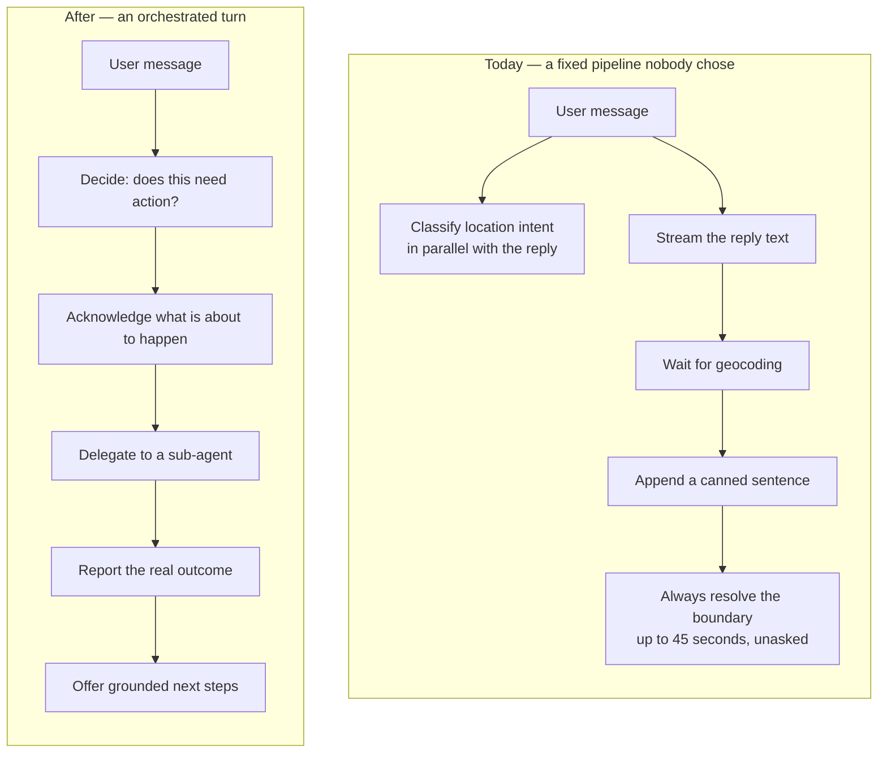

The user-visible difference, for the request *"Show me Al Safa Park 2"*:

| Today | After |
|---|---|
| One bubble, arriving after everything finished | A bubble per step, arriving as the work happens |
| A canned confirmation sentence | A sentence written from the real result |
| The boundary drawn silently, up to 45 s of dead air | The same work, announced before it starts and reported when it ends |
| No idea what is happening or what remains | You always know which step is running and which are still to come |
| Nothing to do next but type | Sometimes a short list of genuinely useful next steps — often nothing, which is correct |

---

## 2. Why the current design cannot do this

It is worth being precise about the failure, because the fix follows directly from it.

The existing code fires the location classifier **concurrently** with the model's reply stream, deliberately, so that classification never delays the first token the user sees. That decision has an unavoidable consequence: by the time the classifier's verdict arrives, the model has already written its reply. The model therefore *cannot* mention what it found, because when it was writing it did not yet know.

That single race is the root of the flat, un-agentic feel:

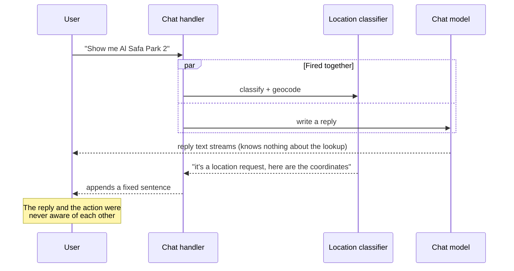

Everything else follows from the same shape. There is no place for Lucy to say *"let me find it first"*, because at that moment nothing has decided that a lookup is needed. There is no place for her to offer next steps, because nothing in the system knows what she is currently capable of. And the boundary lookup runs as a hidden side effect of geocoding — the user is never told it is happening, so up to forty-five seconds pass with a reply on screen that looks finished and is not.

Note the distinction, because it matters for what follows: the problem with the boundary step is **not that it runs**. It is that it runs invisibly, as a consequence of something else, with no way to know it is happening or when it will end.

---

## 3. The five moving parts

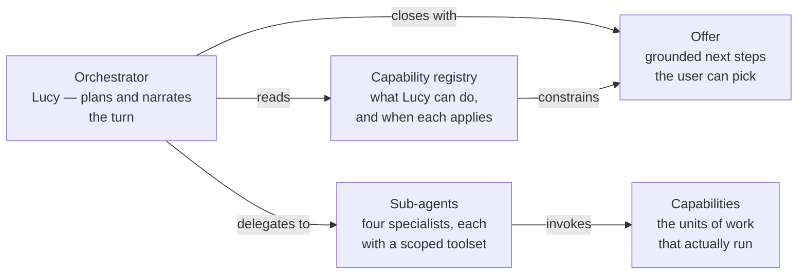

**The orchestrator** is Lucy herself. She holds no tools. Her entire job is to read the request, decide which specialist should handle which part of it, and write the words the user reads. Holding no tools is deliberate: it makes *"Lucy did it herself"* structurally impossible, so the record of what happened always names a specialist.

**The capability registry** is the list of things the platform can do — find a place, outline a site, search your documents, move the viewer — together with, for each one, a description of *when* it is the right choice and a rule for whether it is usable right now.

**Sub-agents** are agents Lucy calls, as opposed to agents you call. There are four: site/location, knowledge and documents, memory, and viewer control. Each holds only the capabilities its own area needs. This is a safety property, not tidiness: the knowledge sub-agent holds no viewer capability at all, so it cannot move your map however badly its reasoning goes wrong.

**Capabilities** are the executable units. Each is a C# class already known to the platform's existing agent runtime, which means each one already passes through permission checks, policy evaluation, timeouts and audit logging — none of that is relaxed because a chat message reached it instead of a background job.

**The offer** is the closing list of next steps. Its defining property is that it is *grounded*: every option corresponds to a capability that exists and is usable right now.

---

## 4. Anatomy of a turn

Follow *"Show me Al Safa Park 2"* through the machinery.

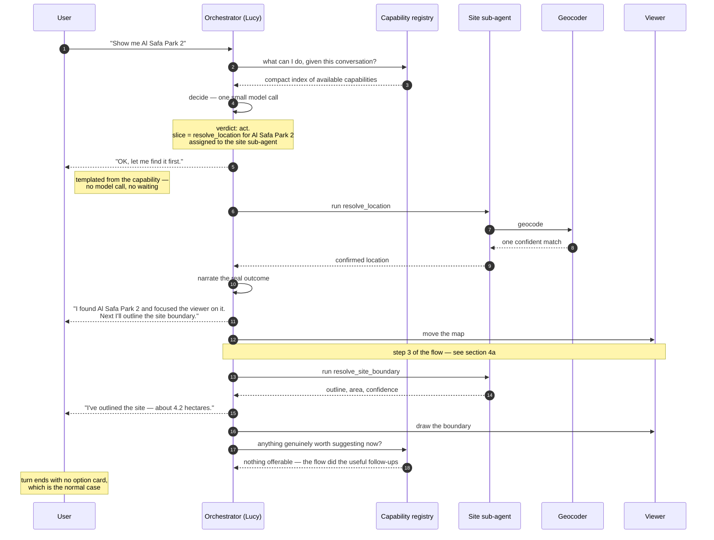

That example is a **flow** — three dependent steps run as one job, covered in section 4a. Four things in it deserve explanation.

**The acknowledgement is not generated.** *"OK, let me find it first."* is a fixed sentence belonging to the `resolve_location` capability. It is emitted the instant routing resolves — no round trip, no tokens, and crucially it still appears even if the model call that follows fails. The first thing the user sees is never at the mercy of a network hop.

**The result sentence *is* generated**, from the actual outcome. This is the half that must be real: if the geocoder returned nothing, or two equally plausible matches, the sentence says so. The old canned strings survive only as a last-resort fallback for when the narration call itself fails, so the user is never left with silence.

**Each beat is its own message bubble.** This matters more than it sounds. In the current system the boundary confirmation was appended to a bubble the user had usually already read, which silently rewrote text under them and ran two unrelated statements together. Separate bubbles also let each one be spoken aloud as it arrives, rather than the whole turn being read out at the end.

**The viewer moves before any optional work starts.** The map update is delivered and flushed the moment it exists. This ordering was hard-won in an earlier fix and is preserved deliberately: a slow or failing optional step must never be able to hold or discard a result the user has already earned.

---

## 4a. Flows — when several steps are really one job

Some requests are not one action. *"Show me Al Safa Park 2"* is three: find the place, focus the viewer on it, outline the site. And they are not three independent choices — each one is meaningless without the one before it. You cannot focus a viewer on a place that was not found, or outline a site whose location is unknown.

Presenting those as separate options to accept would be a category error. The user asked to be shown a site; asking them three times whether to continue is asking them to authorise their own request repeatedly.

So Lucy runs them as a **flow**: a named, ordered sequence of steps that runs as one job, narrating as it goes.

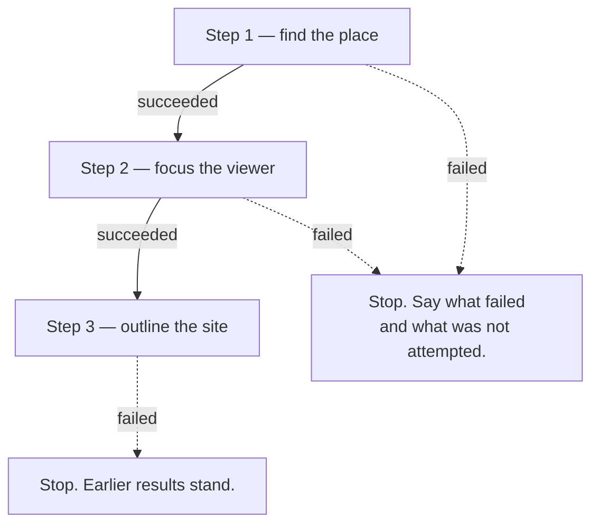

**Every step is announced before it runs** — uniformly, whether it takes thirty seconds or a fifth of one. What keeps that from becoming chatter is pairing each step's completion with the next step's announcement in the same message:

```text
"Looking for Al Safa Park 2."
   ⟳ Looking for Al Safa Park 2
"Location found. Now focusing the viewer on it."
   ⟳ Focusing the viewer
"Site focused. Now highlighting the boundary."
   ⟳ Highlighting the boundary
"Boundary highlighted — about 4.2 hectares, medium confidence."
```

Three steps, four messages. Separate "done" and "starting" messages would have produced seven, and a two-hundred-millisecond step would have got two of its own about work that had already finished. Paired, every step is named exactly once as it begins and once as it ends — and no future flow author has to judge whether a step is "long enough to mention".

Four properties make this trustworthy rather than merely automatic.

**Dependency is real, not decorative.** A step runs only if its predecessor succeeded, and receives that predecessor's result rather than working it out again. The place is geocoded once.

**A stopped flow names the cause, and only the cause.** If the place is not found, Lucy says exactly that — she does not add "…so I haven't focused the viewer or outlined anything". A dependent sequence stopping at a failure is self-evident; spelling it out reads as padding. The steps that never ran go into the record instead, where they answer "why was the boundary never drawn?" without costing the user a sentence.

**Work already done is skipped, not repeated.** Ask for the same site twice and the second run notes that the boundary is already drawn and moves on.

**The user stays in control.** A request can scope the job — *"just find it, don't outline it"* runs step one alone — and a running flow can be interrupted, keeping whatever completed.

### Run it, or offer it? That depends on how you asked

A flow running automatically is right for an instruction and wrong for a question. *"Show me Al Safa Park 2"* is a request to be taken there. *"Do you know Al Safa Park 2?"* is not — answering it by moving someone's map and spending thirty seconds outlining a site is the same overreach this whole design set out to remove, just relocated from a hidden pipeline into a declared flow.

So the intent decides:

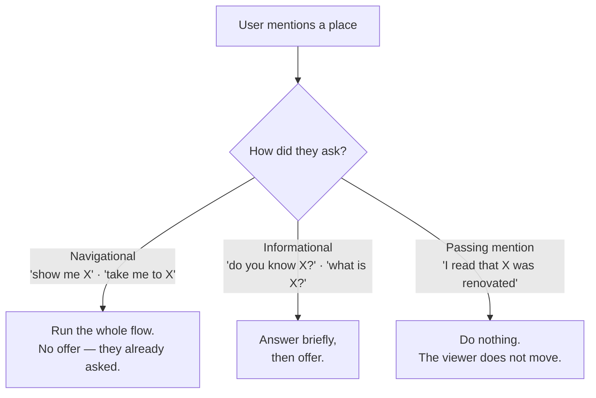

What gets offered in the middle case is a **mixed** list of whatever is logically related to what just happened — not only pieces of the flow:

```text
User:  Do you know Al Safa Park 2?
Lucy:  Yes — it's a public park in the Al Safa district of Dubai.

       What would you like to do?
       ○ Focus the viewer on it — Find it and centre the map on it.
       ○ Focus and outline the site — Find it, centre the map, and outline
         the site boundary.
       ○ Give you more information about it — More detail on the park itself.
       ○ Nothing for now
```

The first two are **flow variants** — named prefixes of the flow, each a whole outcome someone could want. Offering *"outline the boundary"* on its own would be worse than useless: it is step three and cannot run without step one. A variant is a destination; a step is machinery the user should never have to assemble.

The third is a **conversational follow-up**, and it runs nothing at all — it simply asks Lucy to say or ask something. That kind of suggestion is often the most useful one available, and forcing it to be modelled as a "capability" would be a fiction: there is no code to run, no data to fetch, no permission to check.

Only the decline row is added by the server. There is no free-text row: the composer is live throughout, so a user who wants something else simply types it.

### Where follow-ups come from, and how they stay honest

Follow-ups are **composed for the situation**, not picked from a list. They draw on four things: what Lucy has learned from comparable turns (via the memory subsystem — what this user, and users in this situation, went on to want); the need to clarify an ambiguous request; obvious successors implied by the capability index; and her own judgement about what is worth raising.

That last point about clarification is worth dwelling on. Making *"did you mean Al Safa Park or Al Safa Park 2?"* a first-class follow-up finally gives a home to the multi-candidate disambiguation case that has been described in the specs since 035 and never built — an ambiguous place name can be resolved by offering the candidates rather than refusing the request.

Being composed rather than registered reopens the grounding problem. To see why, look at what the rows actually are:

```text
○ Focus and outline the site          ← action row  — clicking this MOVES THE MAP
○ Search my knowledge bases for it     ← action row  — clicking this SEARCHES FILES
○ Give you more information about it   ← follow-up   — clicking this makes Lucy TALK
○ Nothing for now                      ← decline
```

**Action rows carry a hidden key** — `locate_a_place:full`, `search_knowledge_base`. Before the card is shown, the server looks that key up in the registry of things that really exist. Found, keep it; not found, delete it and log it. Had Lucy proposed *"Show you 360° photos"* as an action row, it would carry a key like `show_360_photos`, which is in no registry, and the row would never reach the screen. That check is a lookup in a list, so it is exact.

**A follow-up row carries no key** — it is a sentence Lucy composed. There is nothing to look up. So what stops her writing *"Show you 360° photos of it"* here instead? Two different things, which is why one kind of row needs two guarantees:

| Row | What it does when clicked | What is guaranteed | How |
|---|---|---|---|
| "Focus and outline the site" | Moves the map, draws the outline | The thing it names **exists and is usable right now** | Its key is checked against the registry before the card is shown |
| "Search my knowledge bases for it" | Runs a search | Same | Same |
| "Give you more information about it" | Lucy writes more text | Clicking it **can never** run anything | The code path for a follow-up has no branch that reaches a capability — none |
| "Give you more information about it" | — | At most 2% over-promise | Before showing, the wording is checked: promising *doing* ("show", "open", "draw") rather than *saying* ("tell you", "explain", "compare") gets the row deleted and logged |

The third row is what makes the fourth acceptable. In the worst case — Lucy writes a bad follow-up and the wording check misses it — the only thing that can happen is Lucy talking, and possibly having to admit she cannot do what she just offered. Embarrassing; not broken. Nothing moves, nothing fires, no wrong action occurs.

**In one sentence: anything on the card that would *do* something is guaranteed real; anything that only *talks* might occasionally over-promise, but can never actually do the wrong thing.**

That is why the success criteria were split in three rather than kept as a single "100% of options are grounded". The single version stopped being enforceable the moment follow-ups became open-ended, and a criterion nobody can enforce is worse than an honest pair.

Accepting a variant runs it from the beginning, with exactly the narration a navigational request would have produced.

**Borderline questions resolve to offering.** The asymmetry is not close: offering when Lucy should have acted costs one click, while acting when she should have offered moves someone's viewer uninvited and spends half a minute doing it.

Steps that are genuinely instant are not announced separately. Focusing the viewer takes a fraction of a second; giving it its own announcement and its own report produces two messages about work that finished before either could be read. It folds into the previous report instead. Ceremony is not progress.

### The honest trade

An earlier version of this design made the boundary step optional, offered rather than automatic, and claimed a large speed win from not doing work nobody asked for. That version is withdrawn. The same work is now done every time, so **the turn is not faster than it is today** — the wait is simply narrated instead of silent.

That is a deliberate exchange of speed for continuity, and worth knowing about if you revisit this later. What replaces the speed target is a legibility target: at no point in a flow should a user be unable to say which step is running and which remain.

### Why not the existing workflow engine?

The platform already has a workflow engine — a real DAG walker with branching, parallel fan-out, loops, retries and approval pauses. It is not used here, for two reasons.

It is structurally wrong: it runs as a background job, does not stream, and can suspend across processes to wait for a human. A conversational flow must speak before and after every step, inside one request, and can never suspend.

And it is far more machinery than the shape needs. A flow is a **line, not a graph** — no branches, no merges, no loops. Using a DAG engine to walk a straight line would mean authoring graph nodes, connections and an expression language for what is a short ordered list. The two remain complementary: a *workflow* is something a user builds in a designer for repeatable automation; a *flow* is a platform-declared conversational sequence. If a flow ever genuinely needs a branch, promoting it to a real workflow is the right move — not growing a second DAG engine.

---

## 5. The capability registry, and why it has three layers

This is the part most likely to be unfamiliar, and it is borrowed from a well-tested idea: **progressive disclosure**, the same architecture Anthropic's Agent Skills use.

The problem it solves is a budget problem. Anything you want a model to choose from must be described to it, and every word of that description is paid for on every single message. Describe seven capabilities in full — including the JSON schema for their arguments — and you have spent several hundred words before the user's actual question. Connect a few external tool servers, each publishing dozens of tools, and the description alone dwarfs the conversation.

The answer is to stop treating "the description" as one thing. It is three things with three different readers:

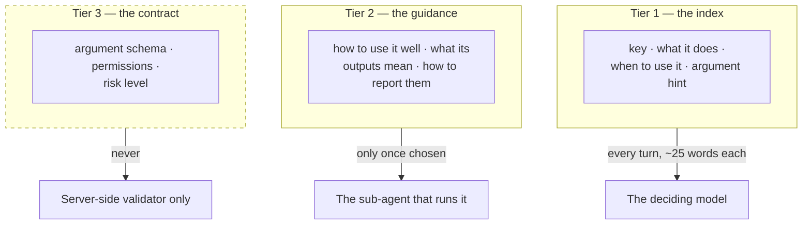

**Tier 1** is the menu. It is short by design, and it must answer two questions, not one: *what does this do*, and *when is it the right choice*. That second half is easy to forget and fatal to omit — a model asked to route between options it has only been told the *purpose* of has nothing to match a user's actual words against. So a Tier 1 entry names the words people really say: "see", "find", "show me", "where is", "take me to".

**Tier 2** is the manual, and it is read only for a capability that was actually chosen. Its length costs nothing until that moment. This is where a capability's hard-won operational knowledge lives — how to interpret a low-confidence boundary match, what to tell the user when a search returns nothing useful. Today that knowledge is scattered through code comments and string constants where no model can reach it.

**Tier 3 never reaches any model at all.** The argument schema, the permissions, the risk level: these are the validator's business. Keeping them hidden turns out to be a security property rather than just an economy. Because the model has never seen the schema its arguments will be checked against, that check is a genuinely independent verification rather than a formality the model can shape itself around.

### When the menu gets too long

Below about ten available capabilities, Lucy is simply shown all of them. Above that — which happens as soon as external tool servers are connected — the platform embeds the user's message using a small language model that already runs in-process on the server, and shows only the most relevant slice of the menu, plus every capability whose availability depends on current context.

The critical constraint: **this narrowing never decides anything.** It chooses what Lucy is shown; Lucy still chooses. A retrieval miss costs a missed option, never a wrong action. And because context-dependent capabilities are always retained regardless of score, the boundary option cannot be filtered away at the exact moment a location has just been confirmed.

That model is an *encoder* — it turns text into a vector for comparison. It is deliberately not a *generator*. A generative model small enough to run on this shared host would take several seconds per decision, which is slower than the entire turn is allowed to be.

---

## 6. Sub-agents and how work is split

Some requests belong to one specialist. Some do not:

> *"Show me Al Safa Park 2 and tell me what our standards say about park setbacks."*

That is a mapping job and a documents job in one sentence. Lucy splits it, routes each half to the specialist that owns it, and reports both together.

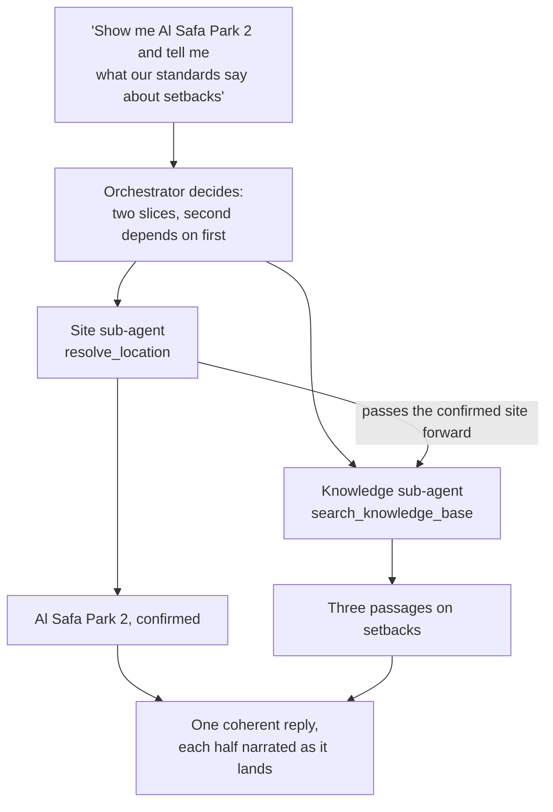

Slices that do not depend on each other run at the same time. Slices that do run in order, with the earlier result handed forward rather than worked out twice. The number of slices per turn is capped, and repeated identical calls are detected and stopped, so a turn cannot wander.

If one half fails, the other still lands. The user is told plainly which part worked and which did not, and keeps the partial result — considerably better than losing a successful lookup because a document search timed out.

**A note on concurrency.** Slices running in parallel each get their own database scope rather than sharing the request's. This is not theoretical caution: this codebase has already shipped and fixed a bug where an un-awaited background task and a reply stream shared one database context and produced hard failures on some AI providers but not others.

---

## 7. How the options stay honest

The single most important guarantee in this design is that Lucy never offers something she cannot do.

The failure mode is easy to picture. Ask a language model to suggest next steps after locating a park, and it will happily propose *"display available photos and 360° images"* — a plausible, appealing, entirely fictional capability. Offer that to a user and you have taught them to expect something the product will then fail to deliver.

You cannot prompt your way out of this. You can only filter your way out of it:

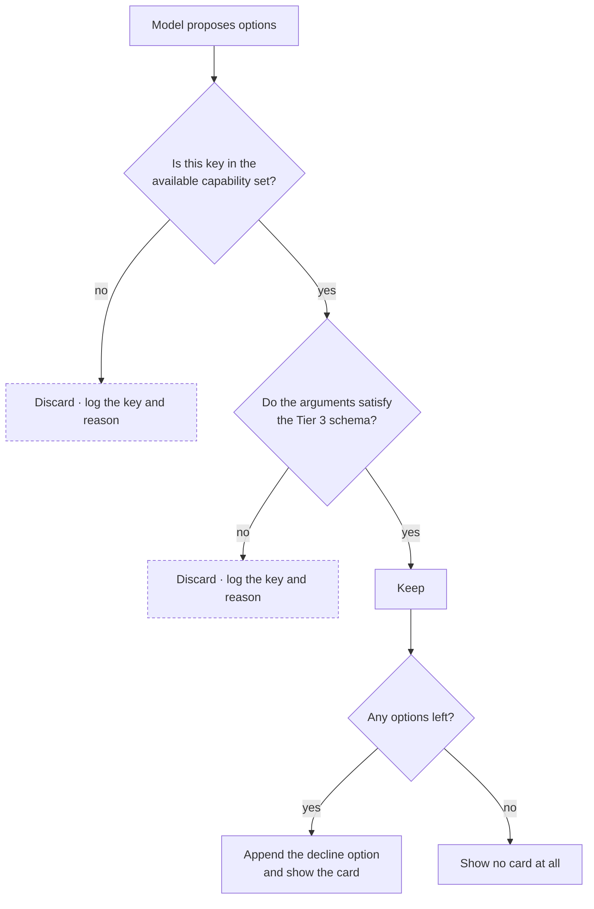

The prompt still tells the model to stay within the menu — but the guarantee rests on the filter, because a prompt cannot promise *zero*. The filter can. Its worst case is an offer shorter than intended, never one that is wrong. Every discard is logged with the proposed key and the reason, so a model that keeps inventing the same capability becomes visible evidence rather than an invisible annoyance.

The decline option — *"Nothing for now"* — is appended by the server and never requested from the model, so it cannot be forgotten.

### The offer is optional, and usually absent

It is worth being emphatic about this, because a system that asks *"what would you like to do next?"* after every message becomes wallpaper within a day.

Two different questions are asked of each capability, and the design originally conflated them. **Available** means *could this run*. **Offerable** means *would this plausibly be wanted next*. They are not the same, and the gap between them is where good manners live:

| Capability | Available | Offerable |
|---|---|---|
| Find a place | always | **never** — you name the place you want; suggesting it unprompted is noise |
| Zoom the viewer | whenever a location is active | **never** — you just ask |
| Check memory | whenever memory is on | **never** — an internal lookup, not a choice |
| Highlight the boundary | whenever a site is found and unoutlined | only in the turn that found it |

Three of the seven capabilities are never offered at all. They exist to be used when asked for, not advertised.

On top of that, the offer step is skipped **entirely — no model call, no event, no card** — whenever:

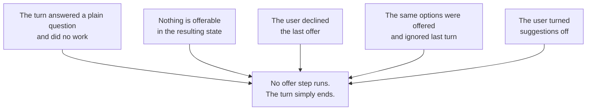

The first rule does most of the work: a turn that took the fast path never reaches the offer step, so ordinary conversation costs exactly one model call — the same as today — and looks exactly as it does today. The third and fourth exist because a decline is an answer, and asking again is nagging.

And even when offerable capabilities do exist, the offer step is allowed to conclude that none is worth mentioning. That answer is honoured: no padding to reach a minimum length, no generic filler suggestion. **Ending a turn in silence is a normal outcome, not a failure of one.**

### Answering an offer

When the user picks an option, the choice is not sent as the text "1". It carries the capability key and the arguments Lucy already bound to it, so the work runs directly with the context she already established — no second interpretation, no re-asking what "1" meant.

Two checks run before it executes. Is this the newest unanswered offer? And is the capability *still* available, checked against fresh state rather than the state at offer time? If the user changed the subject in between, the selection is refused with a readable explanation rather than acting on stale context.

Throughout all of this the composer stays live. The card never blocks typing — a chat interface that stops accepting sentences is broken, however good its buttons are.

---

## 8. When things go wrong

The governing rule in this codebase is that a failure the user experiences as *"nothing happened"* is worse than one they can see and react to. A turn with more moving parts has more places to fail, so each is assigned an outcome in advance.

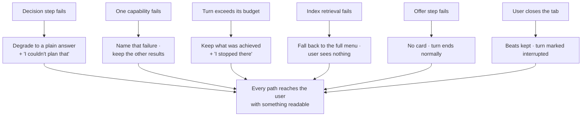

Two of these are worth calling out as **degraded rather than failed**. If Lucy cannot work out a plan, the user still gets a direct answer to their question — they simply lose the orchestration for that turn. If a suggestion is discarded, the turn still completes; it just offers less. Neither is silent, and neither is treated as an error, because in both cases the user was served.

The distinction between *the user cancelled* and *the work timed out* is drawn carefully, against the original request rather than any internal deadline. Getting this backwards would report every user's navigation away as a system failure, which is both wrong and noisy.

---

## 9. Where the time and money go

Two model calls sit on the turn that were not there before: the decision, and the offer. Being honest about that is more useful than minimising it.

**The decision call** is short — roughly two hundred words in, a few dozen out — and runs on whichever model an administrator picks for it, which is expected to be a fast, cheap one. It also *replaces* an existing call: the location classifier that fires today on every message. So for location requests, which dominate this product's use, the count is unchanged.

**The offer call** is the genuinely new cost, but it runs far less often than the phrase suggests. It is skipped entirely on any turn that did no work, on any turn where nothing is offerable, and after a decline. In practice it fires only after Lucy actually did something *and* something sensible follows — so a conversation of ordinary questions makes **one** model call per turn, exactly as today.

When it does run it sits at an awkward place: after the user already has their answer. It is the last thing before the turn closes, so a slow one delays nothing the user is waiting for, but it does keep the turn open.

**Sub-agent delegation multiplies.** Three slices means up to four model calls in one turn. This is the price of genuinely splitting a request between specialists rather than asking one model to do everything, and it is bounded by an explicit per-turn cap on calls, tokens, cost and wall-clock time.

Against that, one large saving: the boundary lookup — which today runs on every newly named site, at up to forty-five seconds — now runs only when asked for. For the common case of "show me this place", the turn gets dramatically faster and cheaper, not slower.

---

## 10. What is reused, and what is new

A great deal of this already exists. The platform built a full agent runtime — tool abstraction, budget guards, duplicate-call detection, policy evaluation, audit logging, an execution record model — and then never pointed a conversation at it. In production the agents table is empty.

| Concern | Status |
|---|---|
| Tool abstraction, permissions, risk levels | Reused unchanged |
| Budget guard, duplicate-call detection, policy evaluation | Reused unchanged |
| Execution / step / tool-call / error records | Reused unchanged — a turn *is* an execution |
| Beat separation and pending labels | Reused — built for the boundary step, now general |
| Viewer payloads for location and boundary | Frozen — not touched |
| In-process embedding model | Already coded; this feature deploys it at last |
| Streaming orchestrator | **New** — the existing one is background-only and cannot stream |
| Capability tiering and availability rules | **New** |
| Grounded suggested actions and the option card | **New** |
| System-provisioned agents | **New** — this is what fills the empty catalog |

The system agents are provisioned automatically at startup, versioned by a hash of their definitions so a release upgrades them without losing history, and blocked from every user-facing edit path. They are visible and readable — so *"which agent did this?"* has an answer — but not editable.

---

## 11. Where it sits in the codebase

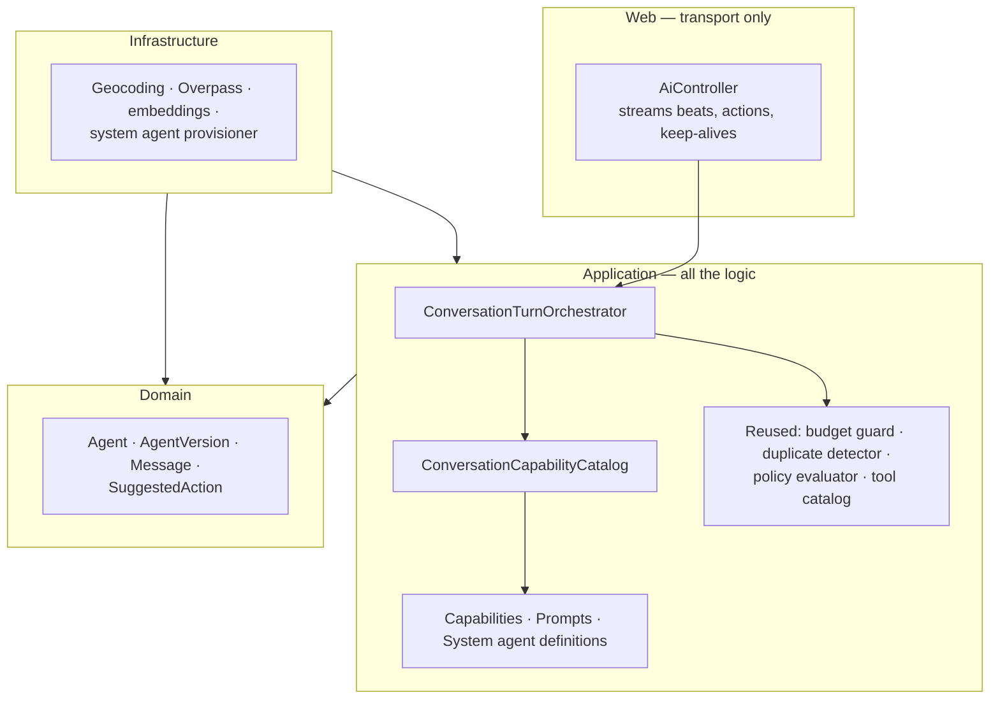

The dependency rule is unchanged: everything points inward. The orchestrator lives in the application layer and knows nothing about HTTP, databases or external services — it talks to interfaces that the infrastructure layer implements. The controller gains one new event type and no decisions of its own.

The schema changes are modest: three nullable columns on messages, three on agents, one widening on agent versions, and one small preferences table. Nothing is dropped, and conversations that predate the feature read back unchanged.

---

## 12. Known weaknesses

In keeping with this repository's convention, the honest list — not the brochure.

**The decision step is a new single point of routing failure.** It degrades safely, but a systematically wrong router produces a systematically wrong product. The mitigation is evaluation scenarios per capability, written before the guidance prose; the risk is that they are written once and never revisited.

**A templated acknowledgement can confidently announce the wrong thing.** "OK, let me find it first" is emitted the moment routing resolves — before the work runs. If routing picked the wrong capability, the user reads a confident sentence about work that was never appropriate. The result beat corrects it, but the first impression was wrong.

**The offer call sits after the answer.** The user has what they asked for and the turn is still open. This is the least defensible latency in the design. If it proves annoying, the fallback is to derive options deterministically from availability rules and skip the model entirely — cheaper and duller.

**Chat turns will fill the agent execution history.** Reusing the execution tables is a large DRY win and gives the audit trail for free, but it means the executions list — previously a small set of deliberate agent runs — becomes mostly conversation turns. That view will need filtering.

**Which offer a selection answered is inferred positionally.** Messages are append-only, so the selection is recorded on the user message it created rather than on the offer it answered. Replay works because the transcript is chronological, but there is no explicit foreign key, and an unusual interleaving could confuse it.

**Agent versions can now have no model bound.** A version whose provider and model are null means "resolve at run time by capability". This is honest for system agents and meaningless for user agents, and nothing in the type system prevents the background runtime from encountering one. It is guarded by convention and tests, not by the compiler.

**Embedding retrieval can hide a capability the user wanted.** Always retaining context-gated entries covers the important cases, but a rarely-phrased request against a large external tool catalog may simply not surface the right tool. It fails quietly — the option is absent rather than broken — which is the hardest kind of failure to notice.

---

## 13. Glossary

| Term | Meaning |
|---|---|
| **Turn** | One user message and everything Lucy did in response |
| **Beat** | One step of a turn, delivered as its own message bubble |
| **Orchestrator** | Lucy — plans and narrates, holds no tools |
| **Sub-agent** | An agent Lucy calls rather than one you call; holds a scoped set of capabilities |
| **Capability** | A unit of work Lucy can perform, with a description, an availability rule and executable code |
| **Turn context** | The snapshot of conversation state that availability is judged against |
| **Tier 1 / 2 / 3** | The index shown every turn · the manual read when chosen · the contract no model sees |
| **Grounding** | Discarding any proposed option that does not map to a real, currently available capability |
| **Fast path** | A turn needing no action, answered directly with no orchestration |
| **Degraded turn** | A turn where something failed but the user was still served |

---

## 14. Further reading

- [`specs/045-conversational-agent-runtime/spec.md`](../specs/045-conversational-agent-runtime/spec.md) — the requirements, in user-story form
- [`research.md`](../specs/045-conversational-agent-runtime/research.md) — fifteen decisions with rejected alternatives
- [`contracts/conversation-capability.md`](../specs/045-conversational-agent-runtime/contracts/conversation-capability.md) — the capability interface and how to write an index entry
- [`contracts/turn-stream.md`](../specs/045-conversational-agent-runtime/contracts/turn-stream.md) — the wire format and the full failure matrix
- [`LOCATION_TO_BOUNDARY_END_TO_END.md`](./LOCATION_TO_BOUNDARY_END_TO_END.md) — how it works today, before this change
