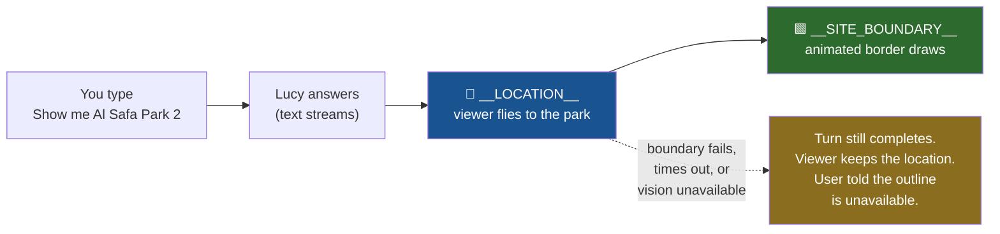
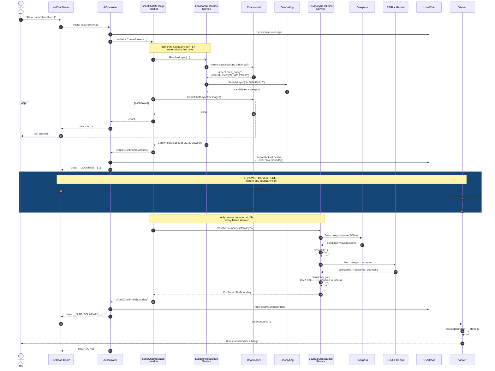
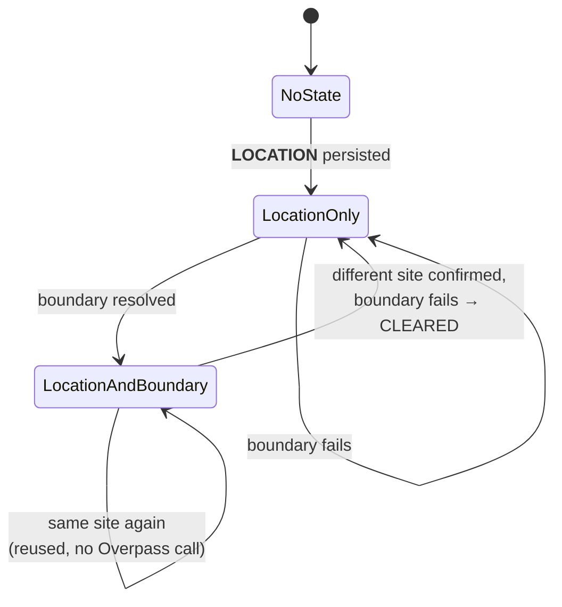
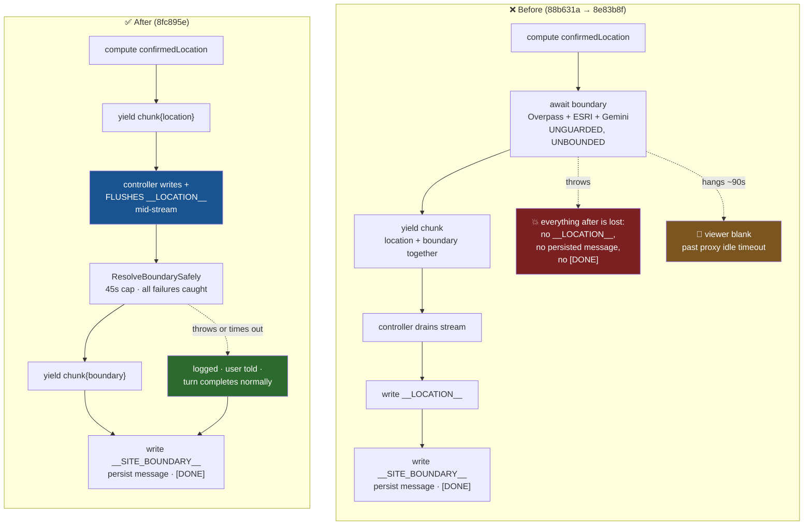

# "Show me Al Safa Park 2" — End to End

> **Scope:** every component, call, and state change between the keystroke and the animated
> border on the map. Spans specs **036** (startup geolocation), **037** (location resolution),
> **038** (POI zoom), **042** (site boundary), and **044** (this regression fix).
>
> **Audience:** architecture review. Section 9 is a deliberate self-critique — the weaknesses,
> not just the design.
>
> **Accurate as of** commit `8fc895e` (2026-08-30).

---

## 1. The short version

Your sentence triggers **two AI calls, up to three external HTTP services, and two independent
SSE events**. The critical design property is that the **location** and the **boundary** travel
separately, in that order, and the second can fail without touching the first.

That fork at `C` is the whole point of spec 044. Before it, `D` was a prerequisite for `C`.

---

## 2. The cast

### Backend

| Component | Layer | Job |
|---|---|---|
| `AiController.Chat` | Web | Owns the SSE wire. Writes `data:` frames, persists messages, terminates with `[DONE]`. |
| `SendChatMessageCommandHandler` | Application | MediatR **stream** handler. Orchestrates retrieval, memory, location, zoom, boundary. Yields `ChatStreamChunk`s. |
| `LocationResolutionService` | Application | Classifies intent (its **own** AI call), then geocodes. Never throws. |
| `IGeocodingProvider` | Infrastructure | `GoogleMapsGeocodingProvider` when a key is set, else `NominatimGeocodingProvider`. |
| `ViewerZoomDetector` | Application | Pure keyword check for "zoom in/out". Zero latency. |
| `BoundaryResolutionService` | Application | Overpass search → deterministic scoring → optional vision → final polygon. |
| `OverpassBoundaryCandidateProvider` | Infrastructure | OSM Overpass query, tag-scoped to curated `leisure`/`amenity` values. |
| `BoundaryCandidateScorer` | Application | Weighted score: source 0.35, name 0.20, geometry 0.15, proximity 0.20, land-use 0.10. |
| `EsriSatelliteImageProvider` | Infrastructure | 640×640 PNG from ESRI World Imagery. Keyless. Returns `null` on failure. |
| `GeminiBoundaryVisionAnalyzer` | Infrastructure | Multimodal `generateContent`. Picks a candidate **and** reports what it visually sees. |
| `RecordActiveLocationCommand` | Application | Persists `ActiveLocation` **and** clears a stale `ActiveBoundary`, atomically. |
| `RecordActiveSiteBoundaryCommand` | Application | Persists `ActiveBoundary`. |
| `UserChat` | Domain | Owns `ActiveLocation` + `ActiveBoundary` and their invariants. |

### Frontend

| Component | Job |
|---|---|
| `aiApi.streamChat` | `fetch` + `ReadableStream` SSE reader. Dispatches **by line prefix** — no ordering state. |
| `useChatStream` | Consumes events, updates stores, owns the assistant message. |
| `activeLocationStore` | Zustand. `{source, lat, lng, name, confidence, locationType, viewport}`. |
| `activeSiteBoundaryStore` | Zustand. `{siteName, centroid, polygon, area, confidence, level, source, …}`. |
| `ViewerSurface` | Watches location store → adds the GIS layer, moves the camera. |
| `POIMarkerOverlay` | Watches location store → drops the pin. |
| `SiteBoundaryOverlay` | Watches boundary store → `handle.setSiteBoundary(...)`. Renders nothing itself. |
| `GoogleMapsGisLayer` | Three.js: static perimeter line + two additive "comet" sweeps, bloom-lit. |
| `SiteBoundaryConfidenceBadge` | Shows confidence level + source provenance. |

---

## 3. End-to-end sequence

---

## 4. What changes, and where

### In the chat

| Moment | Chat surface |
|---|---|
| Send | User message persisted, appears immediately |
| Streaming | Assistant text accumulates token by token |
| Location resolved | Deterministic sentence appended: *"I've located Al Safa Park 2."* |
| Boundary resolved | Second sentence: *"I've outlined Al Safa Park 2's boundary with high confidence, based on OpenStreetMap (leisure=park)."* + alternatives + AI-verification note |
| Boundary failed | *"I couldn't look up the site boundary right now…"* — says **site boundary**, never implies the location failed |
| Done | Assistant message persisted with provider, model, tokens, cost, latency |

**Next turn**, if the boundary succeeded, a system message is injected at position 0 telling the
model a boundary is active for this site, with its confidence and source — so "how sure are you?"
is answerable from context with no new tool call.

### In the viewer

| Trigger | Viewer change |
|---|---|
| `__LOCATION__` | `activeLocationStore.setFromAgent` → `ViewerSurface` adds the GIS layer (first time), then **`fitBounds(viewport)`** — falls back to `zoomToAltitude(locationType)` then `zoomToLocation` |
| ↳ same event | `POIMarkerOverlay` drops the pin |
| ↳ same event | If the new name ≠ stored boundary's name, `clearBoundary()` — the old outline disappears **before** the camera settles |
| `__SITE_BOUNDARY__` | `activeSiteBoundaryStore.setBoundary` → `SiteBoundaryOverlay` calls `handle.setSiteBoundary({exteriorRing, confidenceLevel})` |
| ↳ same event | `GoogleMapsGisLayer` builds a `THREE.Line` perimeter + two arc-length-parameterised comets through `UnrealBloomPass` |
| ↳ same event | `SiteBoundaryConfidenceBadge` renders level + provenance |

### In the database

**Invariant:** `ActiveBoundary` must never outlive the site it names. Enforced in
`RecordActiveLocationCommandHandler`, in the *same* unit of work as the location write — so the
two can never be observed disagreeing.

---

## 5. The ordering property (what spec 044 actually changed)

This is the part worth reviewing closely.

**Two changes were required, and either alone is inert:**

1. The handler yields the location chunk *before* the boundary await.
2. The controller **flushes** `__LOCATION__` the moment it sees that chunk, instead of after the
   `await foreach` drains.

Doing only (1) changes nothing observable, because the controller still waited for the whole
stream. This is the trap the plan called out and the reason `AiControllerChatStreamTests` asserts
at the controller level rather than the handler level.

> **Implementation note.** The guarded call had to be extracted into
> `ResolveBoundarySafelyAsync`. C# forbids `yield return` inside a `try`/`catch`, which is very
> plausibly *why* the original code had no protection around it — the obvious inline fix does not
> compile, and the non-obvious one is a refactor.

---

## 6. Failure paths

Every leaf reaches `[DONE]`. There is no path that silently drops the turn.

### The importance floor is a real gate, and it is provider-relative

The `FL` node above is drawn separately for a reason: it is not part of "0 results", and
it is where "show me Al Safa Park 2 in the viewer" was dying long after the boundary and
streaming paths had each been rewritten to fix it.

`GeocodingCandidate.Importance` has two completely different meanings depending on which
`IGeocodingProvider` is registered — and which one that is, is decided silently by whether
`Geocoding:GoogleMapsApiKey` happens to be set:

| Provider | Where `Importance` comes from | Observed range |
|---|---|---|
| `GoogleMapsGeocodingProvider` | synthesised from `location_type` | 0.40 – 0.90, never lower |
| `NominatimGeocodingProvider` | Nominatim's own `importance` field | 0.0 for a name collision, ~0.06–0.09 for an ordinary local place, 0.56 for Burj Khalifa |

Nominatim's score is Wikipedia-linkage **popularity**, not match **quality**. Measured live
(2026-08-30):

| Query | Top result | `importance` |
|---|---|---|
| `Al Safa Park 2` | حديقة الصفا 2, Dubai — the correct park | **0.0801** |
| `Burj Khalifa` | برج خليفة, Dubai | 0.5588 |
| `Dubai Mall` | دبي مول, Dubai | 0.4451 |
| `Dubai Mall` | unrelated streets in India / Egypt | 0.0 |

With the floor at `0.1`, the sole correct candidate for Al Safa Park 2 was discarded, the
turn resolved to `NotFound`, no `ConfirmedLocation` was produced — and therefore neither
`__LOCATION__` nor the boundary step, which is gated on `confirmedLocation is not null`,
ever ran. Production, which has a Google Maps key, never reproduced it: 0.40 clears 0.1
comfortably. The floor is now `0.05` and configurable, which still rejects the 0.0
collisions above.

If a place query works deployed and not locally, read the startup line
`Geocoding provider: … (Geocoding:GoogleMapsApiKey …)` before suspecting the code.

---

## 7. Time budgets

| Stage | Typical | Cap | Where |
|---|---|---|---|
| Intent classification | 0.5–2 s | model default | concurrent with main stream |
| Geocoding | 0.2–1 s | 30 s client | `"Geocoding"` HttpClient |
| Location wait after text ends | ~0 s | **30 s** | `LocationResolution:ResolutionCeilingSeconds` |
| Overpass | 2–10 s | 30 s client | `"Overpass"` HttpClient |
| ESRI imagery | 1–3 s | 30 s client | `"EsriWorldImagery"` HttpClient |
| Gemini vision | 5–20 s | **30 s** | `BoundaryScoring:VisionTimeoutSeconds` |
| **Whole boundary step** | **10–30 s** | **45 s** | `BoundaryScoring:BoundaryTimeoutSeconds` |

Validated at startup: `BoundaryTimeoutSeconds > VisionTimeoutSeconds`, else vision could never
finish inside the aggregate budget and would be silently disabled in production.

Per-dependency limits **sum** (~90 s) — that is why an aggregate cap exists and why 30 s was
rejected for it: a slow-but-healthy Overpass run alone can consume 30 s.

---

## 8. Why the pieces sit where they do

| Decision | Reasoning |
|---|---|
| Boundary in the chat turn, not a background job | Smallest change that closes both failure modes. A background job + push channel is a re-architecture with its own failure surface. |
| Location emitted first | It is the **mandatory** outcome; the boundary is **optional**. Treating them symmetrically is exactly what let one damage the other. |
| Protection at two layers | Different invariants: the service-level wrap keeps *vision optional*; the handler-level catch-all keeps the *turn intact* regardless of the service's internals. |
| Stale-clear in `RecordActiveLocationCommandHandler` | It already loads the chat and owns the unit of work, so the clear is atomic. Critically, it fires even when **no boundary command ever arrives** — the failure case. |
| Vision may override geometry, but gated | A single-candidate site has nothing to "pick"; only a geo-referenced visual read can fix a shifted polygon. Trusted only after an area/centroid plausibility check. |
| No client changes | `aiApi.ts` dispatches by prefix with no ordering state; `useChatStream` already cleared stale overlays. Verified, not assumed. |

---

## 9. Honest weaknesses

Things a reviewer should push on.

1. **Two AI calls per turn.** Intent classification is a full model round-trip on *every* message,
   including "hello". It runs concurrently so it doesn't add latency, but it costs tokens on every
   turn. A cheap pre-filter (regex/keyword gate before the LLM call) would cut most of that.

2. **`SC-002`'s "5 seconds, 95%" is unmeasured.** After the reorder it's satisfied by construction,
   which makes the number decorative. Nothing in CI enforces it. It should either become a
   structural assertion or be dropped.

3. **The boundary still gates turn completion.** The viewer is safe, but `[DONE]` and
   message persistence still wait up to 45 s. On a shared host with an aggressive proxy idle
   timeout, a slow boundary can still cost the *turn* even though it can no longer cost the
   *viewer*. The background-job option remains the real fix if this bites.

4. **`BoundaryResolutionService` is doing a lot.** Search, scoring, vision orchestration,
   plausibility gating, confidence classification, source description, and message composition in
   one class. It is coherent but close to the edge; the vision-correction logic in particular
   would sit more comfortably behind its own seam.

5. **Vision geometry override is a real trust escalation.** The reference notebook forbade the AI
   inventing coordinates; we allow it, gated. The gate (area 0.3–3.0×, centroid within 500 m) is
   broad. A plausible-but-wrong read inside those bounds is accepted silently — logged only when
   *rejected*, not when *applied*.

6. **Zoom uses a hardcoded altitude table.** `LOCATION_TYPE_ALTITUDE` is a literal inside a React
   component, re-created on every render, and only used when `viewport` is absent.

7. **Test-only environmental coupling.** `AskLucy.Web.Tests` silently falls back to LocalDB and
   fails ~30 tests when `PERSISTENCE_TESTS_CONNECTION_STRING` is unset — a failure mode that looks
   like a code regression but isn't.

---

## 10. Where to look in the code

| Concern | File |
|---|---|
| Orchestration + ordering | `src/AskLucy.Application/Ai/Commands/SendChatMessage/SendChatMessageCommandHandler.cs` |
| Isolation + budget | ↳ `ResolveBoundarySafelyAsync` |
| SSE wire + mid-stream flush | `src/AskLucy.Web/Controllers/v1/AiController.cs` → `WriteConfirmedLocationEventAsync` |
| Intent + geocoding | `src/AskLucy.Application/Locations/LocationResolutionService.cs` |
| Scoring + vision | `src/AskLucy.Application/SiteBoundaries/BoundaryResolutionService.cs` |
| Vision prompt + geo-referencing | `src/AskLucy.Infrastructure/Boundaries/GeminiBoundaryVisionAnalyzer.cs` |
| Stored-state invariant | `src/AskLucy.Domain/Chats/UserChat.cs` + `…/RecordActiveLocation/RecordActiveLocationCommandHandler.cs` |
| SSE parsing | `src/AskLucy.Web/ClientApp/src/features/chat/api/aiApi.ts` |
| Store updates | `src/AskLucy.Web/ClientApp/src/features/chat/hooks/useChatStream.ts` |
| Camera | `src/AskLucy.Web/ClientApp/src/features/viewer/components/ViewerSurface.tsx` |
| Border rendering | `src/AskLucy.Web/ClientApp/src/viewer/layers/gis/GoogleMapsGisLayer.ts` |

**Contracts:** `specs/044-location-viewer-regression/contracts/chat-stream-events.md` is the
current authority on SSE ordering (C-1…C-6), the boundary contract (B-1…B-4), caller obligations
(H-1…H-3), and stored state (S-1…S-4).
