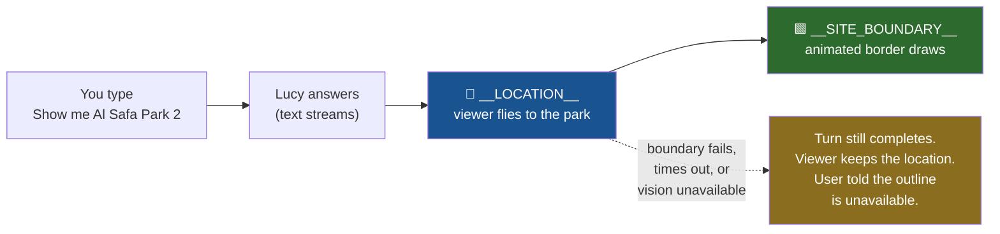
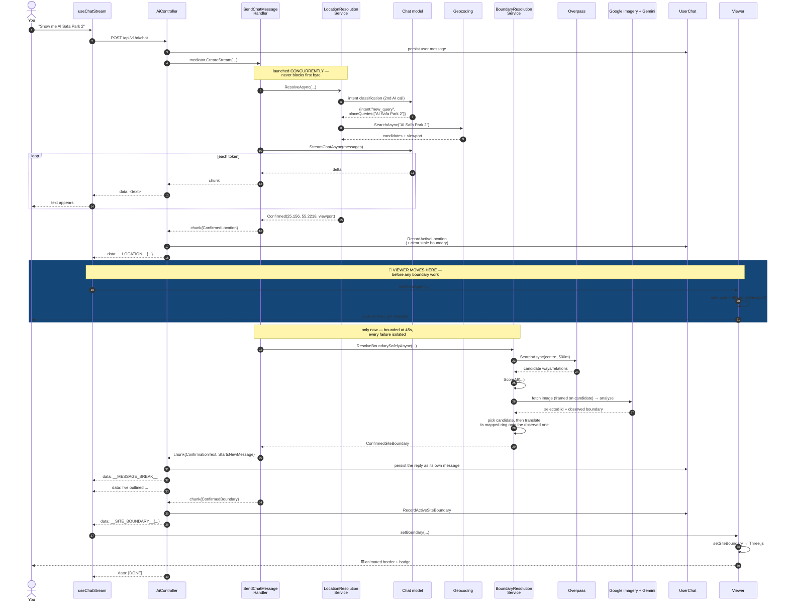
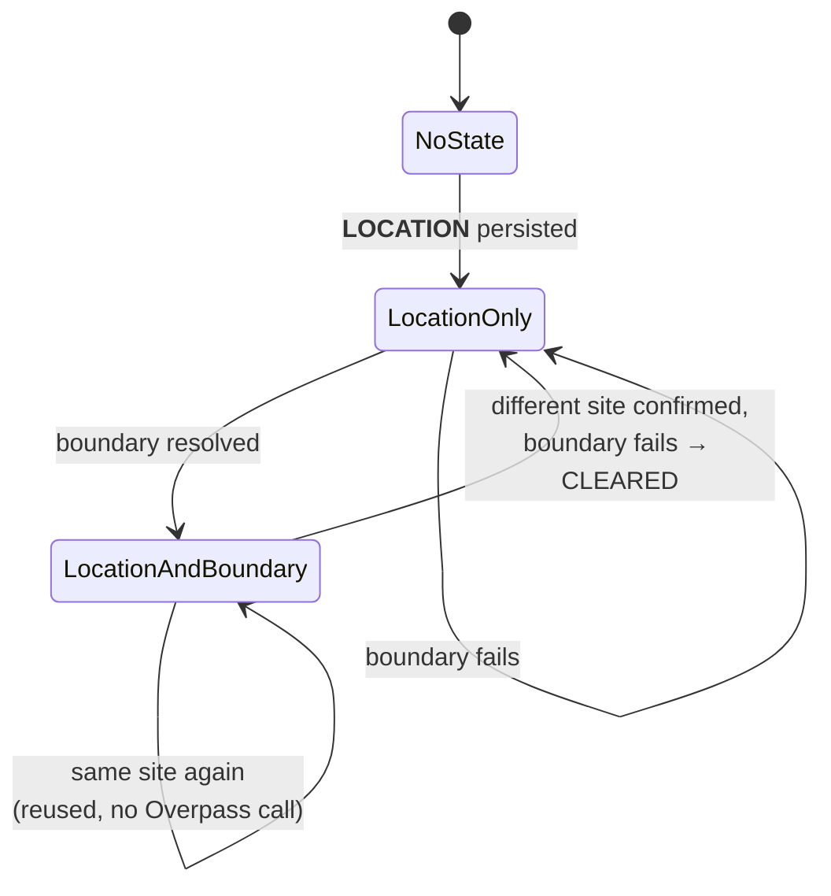
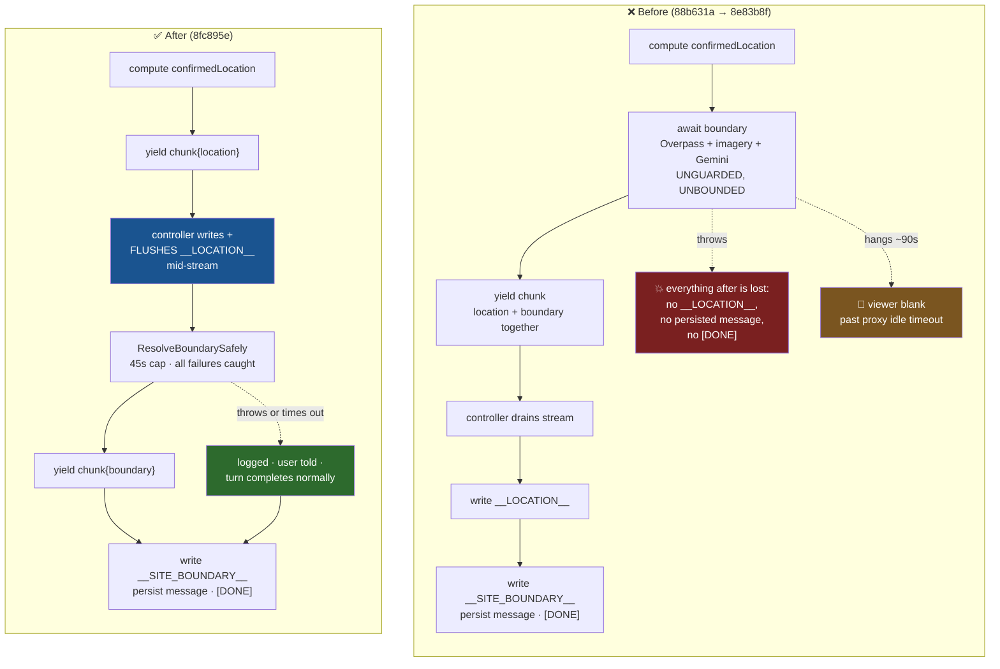
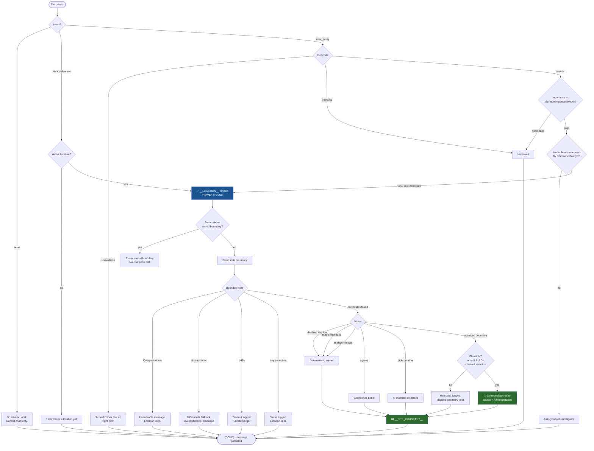

# "Show me Al Safa Park 2" — End to End

> **Scope:** every component, call, and state change between the keystroke and the animated
> border on the map. Spans specs **036** (startup geolocation), **037** (location resolution),
> **038** (POI zoom), **042** (site boundary), and **044** (this regression fix).
>
> **Audience:** architecture review. Section 9 is a deliberate self-critique — the weaknesses,
> not just the design.
>
> **Accurate as of** commit `8fc895e` (2026-08-30).

---

## 1. The short version

Your sentence triggers **two AI calls, up to three external HTTP services, and two independent
SSE events**. The critical design property is that the **location** and the **boundary** travel
separately, in that order, and the second can fail without touching the first.

That fork at `C` is the whole point of spec 044. Before it, `D` was a prerequisite for `C`.

---

## 2. The cast

### Backend

| Component | Layer | Job |
|---|---|---|
| `AiController.Chat` | Web | Owns the SSE wire. Writes `data:` frames, persists messages, terminates with `[DONE]`. |
| `SendChatMessageCommandHandler` | Application | MediatR **stream** handler. Orchestrates retrieval, memory, location, zoom, boundary. Yields `ChatStreamChunk`s. |
| `LocationResolutionService` | Application | Classifies intent (its **own** AI call), then geocodes. Never throws. |
| `IGeocodingProvider` | Infrastructure | `GoogleMapsGeocodingProvider` when a key is set, else `NominatimGeocodingProvider`. |
| `ViewerZoomDetector` | Application | Pure keyword check for "zoom in/out". Zero latency. |
| `BoundaryResolutionService` | Application | Overpass search → deterministic scoring → optional vision → final polygon. |
| `OverpassBoundaryCandidateProvider` | Infrastructure | OSM Overpass query, tag-scoped to curated `leisure`/`amenity` values. |
| `BoundaryCandidateScorer` | Application | Weighted score: source 0.35, name 0.20, geometry 0.15, proximity 0.20, land-use 0.10. |
| `GoogleSatelliteImageProvider` | Infrastructure | Google Static Maps satellite JPEG, framed on the candidate at `scale=2` (~0.27 m/px at park scale). Returns `null` on failure. |
| `EsriSatelliteImageProvider` | Infrastructure | Keyless fallback, registered only when no Google Maps key is configured. Different reference frame from the viewer — see §9.5. |
| `GoogleStreetViewImageProvider` | Infrastructure | Ground-level cross-check: up to 4 photos sampled around the winning candidate's own mapped ring, each aimed back at its centroid. Metadata-checked first (§9.6) — Google-only, no keyless fallback. |
| `GeminiBoundaryVisionAnalyzer` | Infrastructure | Multimodal `generateContent`. Picks a candidate **and** reports what it visually sees, now cross-checking satellite against ground-level photos where any are available. |
| `RecordActiveLocationCommand` | Application | Persists `ActiveLocation` **and** clears a stale `ActiveBoundary`, atomically. |
| `RecordActiveSiteBoundaryCommand` | Application | Persists `ActiveBoundary`. |
| `UserChat` | Domain | Owns `ActiveLocation` + `ActiveBoundary` and their invariants. |

### Frontend

| Component | Job |
|---|---|
| `aiApi.streamChat` | `fetch` + `ReadableStream` SSE reader. Dispatches **by line prefix** — no ordering state. |
| `useChatStream` | Consumes events, updates stores, owns the assistant message. |
| `activeLocationStore` | Zustand. `{source, lat, lng, name, confidence, locationType, viewport}`. |
| `activeSiteBoundaryStore` | Zustand. `{siteName, centroid, polygon, area, confidence, level, source, …}`. |
| `ViewerSurface` | Watches location store → adds the GIS layer, moves the camera. |
| `POIMarkerOverlay` | Watches location store → drops the pin. |
| `SiteBoundaryOverlay` | Watches boundary store → `handle.setSiteBoundary(...)`. Renders nothing itself. |
| `GoogleMapsGisLayer` | Three.js: static perimeter line + two additive "comet" sweeps, bloom-lit. |
| `SiteBoundaryConfidenceBadge` | Shows confidence level + source provenance. |

---

## 3. End-to-end sequence

---

## 4. What changes, and where

### In the chat

| Moment | Chat surface |
|---|---|
| Send | User message persisted, appears immediately |
| Streaming | Assistant text accumulates token by token |
| Location resolved | Deterministic sentence appended: *"I've located Al Safa Park 2."* |
| Boundary resolved | A **second assistant message**: *"I've outlined Al Safa Park 2's boundary with high confidence, based on OpenStreetMap (leisure=park)."* + alternatives + AI-verification note |
| Boundary failed | *"I couldn't look up the site boundary right now…"* — says **site boundary**, never implies the location failed |
| Done | Each assistant message persisted; provider, model, tokens, cost, latency and citations go on the first — the reply itself |

The boundary confirmation is a **separate message**, not more text on the end of the reply. It
reports a second action that finishes seconds after the location did, so appending it ran two
unrelated sentences straight together (*"…centred the viewer on it.I've outlined…"*) and silently
rewrote a bubble the user had already read.

The wire carries this as a bare `data: __MESSAGE_BREAK__` frame, matched **exactly** rather than by
prefix — it has no payload, so a line that merely starts with the marker is ordinary text. On
seeing it the server persists what it has buffered and starts a new message; `useChatStream` closes
the current bubble and opens the next. `ChatStreamChunk.StartsNewMessage` is what asks for it.

**Next turn**, if the boundary succeeded, a system message is injected at position 0 telling the
model a boundary is active for this site, with its confidence and source — so "how sure are you?"
is answerable from context with no new tool call.

### In the viewer

| Trigger | Viewer change |
|---|---|
| `__LOCATION__` | `activeLocationStore.setFromAgent` → `ViewerSurface` adds the GIS layer (first time), then **`fitBounds(viewport)`** — falls back to `zoomToAltitude(locationType)` then `zoomToLocation` |
| ↳ same event | `POIMarkerOverlay` drops the pin |
| ↳ same event | If the new name ≠ stored boundary's name, `clearBoundary()` — the old outline disappears **before** the camera settles |
| `__SITE_BOUNDARY__` | `activeSiteBoundaryStore.setBoundary` → `SiteBoundaryOverlay` calls `handle.setSiteBoundary({exteriorRing, confidenceLevel})` |
| ↳ same event | `GoogleMapsGisLayer` builds a `THREE.Line` perimeter + two arc-length-parameterised comets through `UnrealBloomPass` |
| ↳ same event | `SiteBoundaryConfidenceBadge` renders level + provenance |

### In the database

**Invariant:** `ActiveBoundary` must never outlive the site it names. Enforced in
`RecordActiveLocationCommandHandler`, in the *same* unit of work as the location write — so the
two can never be observed disagreeing.

---

## 5. The ordering property (what spec 044 actually changed)

This is the part worth reviewing closely.

**Two changes were required, and either alone is inert:**

1. The handler yields the location chunk *before* the boundary await.
2. The controller **flushes** `__LOCATION__` the moment it sees that chunk, instead of after the
   `await foreach` drains.

Doing only (1) changes nothing observable, because the controller still waited for the whole
stream. This is the trap the plan called out and the reason `AiControllerChatStreamTests` asserts
at the controller level rather than the handler level.

> **Implementation note.** The guarded call had to be extracted into
> `ResolveBoundarySafelyAsync`. C# forbids `yield return` inside a `try`/`catch`, which is very
> plausibly *why* the original code had no protection around it — the obvious inline fix does not
> compile, and the non-obvious one is a refactor.

---

## 6. Failure paths

Every leaf reaches `[DONE]`. There is no path that silently drops the turn.

### The importance floor is a real gate, and it is provider-relative

The `FL` node above is drawn separately for a reason: it is not part of "0 results", and
it is where "show me Al Safa Park 2 in the viewer" was dying long after the boundary and
streaming paths had each been rewritten to fix it.

`GeocodingCandidate.Importance` has two completely different meanings depending on which
`IGeocodingProvider` is registered — and which one that is, is decided silently by whether
`Geocoding:GoogleMapsApiKey` happens to be set:

| Provider | Where `Importance` comes from | Observed range |
|---|---|---|
| `GoogleMapsGeocodingProvider` | synthesised from `location_type` | 0.40 – 0.90, never lower |
| `NominatimGeocodingProvider` | Nominatim's own `importance` field | 0.0 for a name collision, ~0.06–0.09 for an ordinary local place, 0.56 for Burj Khalifa |

Nominatim's score is Wikipedia-linkage **popularity**, not match **quality**. Measured live
(2026-08-30):

| Query | Top result | `importance` |
|---|---|---|
| `Al Safa Park 2` | حديقة الصفا 2, Dubai — the correct park | **0.0801** |
| `Burj Khalifa` | برج خليفة, Dubai | 0.5588 |
| `Dubai Mall` | دبي مول, Dubai | 0.4451 |
| `Dubai Mall` | unrelated streets in India / Egypt | 0.0 |

With the floor at `0.1`, the sole correct candidate for Al Safa Park 2 was discarded, the
turn resolved to `NotFound`, no `ConfirmedLocation` was produced — and therefore neither
`__LOCATION__` nor the boundary step, which is gated on `confirmedLocation is not null`,
ever ran. Production, which has a Google Maps key, never reproduced it: 0.40 clears 0.1
comfortably. The floor is now `0.05` and configurable, which still rejects the 0.0
collisions above.

If a place query works deployed and not locally, read the startup line
`Geocoding provider: … (Geocoding:GoogleMapsApiKey …)` before suspecting the code.

---

## 7. Time budgets

| Stage | Typical | Cap | Where |
|---|---|---|---|
| Intent classification | 0.5–2 s | model default | concurrent with main stream |
| Geocoding | 0.2–1 s | 30 s client | `"Geocoding"` HttpClient |
| Location wait after text ends | ~0 s | **30 s** | `LocationResolution:ResolutionCeilingSeconds` |
| Overpass | 2–10 s | 30 s client | `"Overpass"` HttpClient |
| Google satellite imagery | 1–3 s | 30 s client | `"GoogleStaticMaps"` HttpClient |
| Street View (up to 4, concurrent) | 0.5–2 s | 30 s client | same `"GoogleStaticMaps"` HttpClient — metadata then image, per viewpoint |
| Gemini vision | 5–20 s | **30 s** | `BoundaryScoring:VisionTimeoutSeconds` |
| **Whole boundary step** | **10–30 s** | **45 s** | `BoundaryScoring:BoundaryTimeoutSeconds` |

Validated at startup: `BoundaryTimeoutSeconds > VisionTimeoutSeconds`, else vision could never
finish inside the aggregate budget and would be silently disabled in production.

Per-dependency limits **sum** (~90 s) — that is why an aggregate cap exists and why 30 s was
rejected for it: a slow-but-healthy Overpass run alone can consume 30 s.

---

## 8. Why the pieces sit where they do

| Decision | Reasoning |
|---|---|
| Boundary in the chat turn, not a background job | Smallest change that closes both failure modes. A background job + push channel is a re-architecture with its own failure surface. |
| Location emitted first | It is the **mandatory** outcome; the boundary is **optional**. Treating them symmetrically is exactly what let one damage the other. |
| Protection at two layers | Different invariants: the service-level wrap keeps *vision optional*; the handler-level catch-all keeps the *turn intact* regardless of the service's internals. |
| Stale-clear in `RecordActiveLocationCommandHandler` | It already loads the chat and owns the unit of work, so the clear is atomic. Critically, it fires even when **no boundary command ever arrives** — the failure case. |
| OSM supplies the shape, vision supplies the position | The mapped ring is surveyed and carries the mappers' detail; what it does not guarantee is sitting on the fence. Vision contributes one translation, applied to every vertex unchanged. See §9.5. |
| No client changes | `aiApi.ts` dispatches by prefix with no ordering state; `useChatStream` already cleared stale overlays. Verified, not assumed. |

---

## 9. Honest weaknesses

Things a reviewer should push on.

1. **Two AI calls per turn.** Intent classification is a full model round-trip on *every* message,
   including "hello". It runs concurrently so it doesn't add latency, but it costs tokens on every
   turn. A cheap pre-filter (regex/keyword gate before the LLM call) would cut most of that.

2. **`SC-002`'s "5 seconds, 95%" is unmeasured.** After the reorder it's satisfied by construction,
   which makes the number decorative. Nothing in CI enforces it. It should either become a
   structural assertion or be dropped.

3. **The boundary still gates turn completion.** The viewer is safe, but `[DONE]` and
   message persistence still wait up to 45 s. On a shared host with an aggressive proxy idle
   timeout, a slow boundary can still cost the *turn* even though it can no longer cost the
   *viewer*. The background-job option remains the real fix if this bites.

4. **`BoundaryResolutionService` is doing a lot.** Search, scoring, vision orchestration,
   confidence classification, source description, and message composition in one class. It is
   coherent but close to the edge.

5. **Two of the three corrections tried here were wrong, and one was right.** The history is
   worth keeping, because each was plausible and only measurement separated them.

   | Step | What it did | Verdict |
   |---|---|---|
   | Basemap alignment | Snapped the ring's centroid onto the geocoded point | **Removed.** For a park Google returns an establishment POI (`location_type` ROOFTOP, `bounds` null) — a marker placed *inside* the polygon, not its centre. It dragged a correct ring 24 m north-west. |
   | Vision replaces geometry (satellite input) | Substituted Gemini's traced outline, read from satellite photography, for the mapped one | **Removed.** The trace is a four- or five-point approximation of an ambiguous real-world scene; substituting it discards whatever detail the mappers surveyed. |
   | Vision repositions geometry | Translates the mapped ring by the offset between its centroid and the observed one | **Removed**, after shipping. See the "Update, post-deployment" note below — four separate live measurements, all worse. |
   | Vision replaces geometry (roadmap input) | Substituted Gemini's traced outline, read from a rendered roadmap image, for the mapped one | **Current approach, unproven.** See §9.7 — this is the same move as the row above it, revived on the theory that the input, not the idea, was the problem. |

   The third was briefly removed too, on the evidence that OSM's ring already matched Google's
   *drawn* park polygon. That comparison was between two vendors' opinions, neither of which is
   ground truth. Against satellite imagery the ring does sit a little off the visible wall, which
   is what the correction is for.

   Two inputs had to change before the correction could work at all. The imagery came from ESRI
   World Imagery — a third reference frame, so a correct read still landed wherever ESRI and
   Google disagree. And it was requested at the 500 m search radius, so a 90 × 166 m park sat in a
   1 km frame with no fence more than a pixel wide; nothing could be traced from it however good
   the model. Both are fixed: Google Static Maps, framed on the candidate, at `scale=2`.

   **What this can and cannot do.** It fixes *position*. It cannot add detail the mapped ring does
   not have — translating a rectangle yields a rectangle. Al Safa Park 2's OSM way, for instance,
   has seven points but only four corners; the other three sit on straight edges, 0.05 m, 0.00 m
   and 0.32 m off the line. If a real fence steps in and out, moving individual vertices would be
   a separate change.

   **The lesson worth keeping:** a geometric correction is a measurement. Compare against ground
   truth — imagery — not against another vendor's drawing.

   **Update, post-deployment:** this "Kept" verdict did not hold up, across two separate attempts
   to save it. First measured plain (no ground-level check): three live boundary turns, each
   against the raw OSM ring on satellite imagery, all shifted the ring *west* — 16 m, 33 m, then
   21 m — all visibly worse. §9.6 added a Street View ground-level cross-check on the theory that
   satellite alone was reading tree canopy as a fence line; measured live a fourth time, it shifted
   the ring *west* again — 35 m, the worst of the four — because Street View coverage for this
   specific park turned out to be too sparse (2 of 4 sampled viewpoints came back
   `ZERO_RESULTS`, the other 2 resolved to the same panorama) to add anything. Translate-based
   correction is now removed rather than capped: §9.7 replaces it with a different approach to the
   same problem.

6. **Ground-level cross-check, added because satellite imagery alone cannot settle a real
   ambiguity.** A user request from early in this feature's life: satellite imagery cannot tell a
   wall/fence from a tree canopy that spills past it, and the westward drift documented above is
   consistent with the vision correction reading canopy, not the fence line. Requested twice
   before it was actually built — the first pass restated the requirement back correctly and then
   only ever implemented the satellite half, which the user caught.

   `GoogleStreetViewImageProvider` samples up to 4 points around the *winning candidate's own
   mapped ring* (one per edge, downsampled if there are more), aims each back at the ring's
   centroid, and hands the resulting photos to Gemini as extra, clearly-labelled parts alongside
   the satellite image — never as a source of coordinates. `observed_boundary_normalized` stays
   relative to the satellite frame only; the photos exist to raise or lower confidence in what the
   satellite image already shows.

   **The gotcha that shaped the implementation.** The Street View Static API does not 404 for "no
   coverage near this point" — it returns 200 OK with a generic gray placeholder image,
   indistinguishable from a real photo by status code or content-type. Silently feeding that to
   the vision analyzer as ground truth would be worse than not calling it at all. The free
   `streetview/metadata` endpoint is checked first, and its `pano_id` — not a second
   location+radius lookup — is what the image request uses, so the two calls cannot disagree about
   which panorama was actually inspected.

   **The ring is now always explicitly closed.** `observed_boundary_normalized` is asked not to
   repeat its first point, but nothing enforces that a model actually complies — `ReadObservedBoundary`
   closes it in code regardless, matching the closed-ring convention every other polygon in this
   codebase already uses.

   **Verified working as designed, and it still didn't help.** Measured against the live server
   log for the turn the user actually tested: all 4 metadata calls and both image calls ran exactly
   as this section describes, for the exact chat and the exact "shifted 35 m" detail text the user
   reported seeing. The gap was coverage, not implementation — 2 of 4 sampled viewpoints had
   `ZERO_RESULTS`, the other 2 collapsed to the same `pano_id` because they were close enough
   together to see the same panorama. One side of this park simply has no Street View. See §9.7 for
   what replaced this.

7. **Roadmap-vector tracing, because the whole "read a real-world scene" premise was the problem,
   not any particular implementation of it.** After four straight measured failures — plain
   satellite, then satellite-plus-Street-View, both drifting the ring further west every time — the
   user pointed out the actual difference between what had been tried here and a manual experiment
   they had already run successfully in ChatGPT: screenshot Google's *roadmap* tiles (not
   satellite), which draw many named places as a solid-coloured polygon with a crisp edge and a
   label, and ask the model to trace *that* — an ordinary image-segmentation task, not an inference
   about where an invisible property line probably runs through a photograph.

   Three things changed together:

   - `GoogleSatelliteImageProvider` now requests `maptype=roadmap` instead of `maptype=satellite`.
     The type and interface names are unchanged (`ISatelliteImageProvider`, `SatelliteImage`) to
     avoid a wide rename for what is, underneath, still "fetch an overhead Google Static Maps
     image at a given center and radius" — see the class's own remarks for the full reasoning.
   - The Gemini prompt no longer asks about "walls, fences, vegetation edges" — visible physical
     features that make sense on a photograph and not on a map rendering. It now asks the model to
     find the shaded/labelled polygon Google has already drawn for the named site and trace its
     outline "corner for corner, including any notch or step in its edge, exactly as rendered."
   - `BoundaryResolutionService` no longer translates. `TryBuildVisionTracedGeometry` (previously
     `TryBuildVisionCorrectedGeometry`) now adopts the traced ring as the final polygon outright,
     tagged `SiteBoundarySource.AiInterpretation`, once it clears two plausibility gates (area
     ratio 0.3x-3.0x of the mapped candidate, centroid within the search radius). The 80 m
     maximum-shift gate from the translate-only design is gone: a large shift is exactly what this
     exists to apply when OSM's ring is the one that's wrong, so capping it would have quietly
     reintroduced the same failure mode this change is meant to fix.

   Street View is kept, downgraded to optional secondary context ("use them only... when the map
   itself is ambiguous about which shape is the named site") rather than removed outright — the
   user's instruction named satellite specifically, not Street View, and a roadmap image can still
   be ambiguous about which of several nearby shaded shapes is the right one.

   **This is the "Vision replaces geometry" row from the table above, revived.** The first time
   this idea was tried, it was removed because the traced shape was a crude approximation of
   real-world photography and substituting it threw away surveyed detail. Nothing about that
   argument was wrong — it just assumed the input would always be a noisy photograph. A rendered
   vector polygon is a categorically different, much lower-noise signal, and trusting it outright
   is the whole point of using it. Whether that theory survives contact with a live boundary turn,
   the way "Kept" did not for the translate-only approach, is not yet known — this shipped without
   one.

   **Update, post-deployment: the offset is fixed, vertex fidelity was not.** The user's live test
   of Al Safa Park 2 confirmed the offset problem is gone — `AiInterpretation` traced a boundary
   20 m from the OSM-mapped position and it matched Google's own rendering on screen, the first
   time any vision-based correction actually agreed with the basemap. But the traced ring itself
   was a plain rectangle where the site's real drawn outline has a small notch (a path/building cut
   into one corner) — Gemini simplified rather than followed the edge, despite the prompt already
   asking for "any notch or step in its edge, exactly as rendered." There is no code path that could
   have substituted OSM's vertex count here: `TryBuildVisionTracedGeometry` returns the observed
   ring verbatim, and the candidate description sent to Gemini carries no OSM coordinates for it to
   echo back (id/name/area/distance/tags only) — the under-tracing is Gemini's own approximation,
   not a blending bug. The prompt now says explicitly not to report a simplified rectangle when the
   drawn shape has more corners than that, to examine each edge individually for a bend, step, or
   cut before treating it as straight, and raises the point ceiling from 12 to 20.

   **Second update: still the same rectangle at 20 points — the ceiling itself was the mistake.**
   A second live test came back with the identical shape; raising 12 to 20 changed nothing, because
   naming any number in the prompt (even as an upper bound) anchors the model toward a small, round
   count instead of "however many the true shape needs." It also only ever asked for points at
   corners, notches, and steps — nothing told it a boundary could curve or wander with no straight
   segments at all. There is no vertex cap anywhere in code (`ReadObservedBoundary` parses whatever
   length array comes back, and the payload sets no `responseSchema` or `maxOutputTokens` that could
   silently truncate one), so every constraint on point count was coming from the prompt text alone.
   The point-count language is gone entirely: the prompt now says to walk the edge like tracing it by
   hand with a pencil rather than a ruler, to lay down points along any curve or gradual bend and not
   only at sharp corners, and to use anywhere from 4 points for a truly rectangular site to several
   dozen for an irregular or curved one — never a "round or convenient number" chosen in advance.
   Still unconfirmed against a live turn.

   **Third update: the prompt was still showing Gemini the OSM candidate list, and that itself was
   the objection.** The user pointed at the exact prompt text: a "Candidate boundary polygons
   already found from OpenStreetMap" block plus an "IMPORTANT RULES for selected_candidate_id"
   section asking the model to pick among OSM's candidate IDs, with the trace instruction worded as
   secondary to it ("this is independent of which candidate you picked above, and matters most when
   a candidate's mapped shape does not line up..."). Even though that block never fed the model any
   OSM *coordinates* (id/name/area/distance/tags only — see the first update above), its presence,
   and the "trace is secondary" framing, is precisely what a "rely on Gemini only" instruction rules
   out. That whole task is now gone: no candidate list, no candidate IDs, no `selected_candidate_id`
   field in the requested JSON. Tracing the boundary is the model's only job.

   This did not require touching `BoundaryVisionAnalysis.SelectedCandidateId` or
   `BoundaryResolutionService`'s candidate-override logic (`SelectFinalCandidate`,
   `"ai_override"`/`"agree"`) — that remains real, independently-tested application-layer behaviour
   for *any* `IBoundaryVisionAnalyzer` that chooses to populate it; the shipped Gemini
   implementation now simply never does. It did surface one real bug worth fixing on the same pass:
   the "this was cross-checked" confirmation note was wired to `selection.Agreement`
   (candidate-ID agreement), not to whether the trace was actually adopted. With
   `SelectedCandidateId` now always null in production, that note would have silently stopped
   appearing for every future successful trace — the note now checks trace adoption
   (`visionGeometry is not null`) first and only falls back to the old agreement-based wording when
   there is no trace to report on.

   **Fourth update: framing the image on OSM's own ring reintroduces the exact problem this whole
   pivot exists to avoid.** `ImageryRadiusFor` sizes the frame Gemini is shown from the winning OSM
   candidate's own bounding box (half-diagonal × 1.35, floored at 60 m, capped at the search
   radius). That ring is the same signal being corrected — if it undershoots the real site's
   extent, the image is clipped to OSM's version of the boundary before Gemini ever sees it, and no
   amount of prompt tuning recovers pixels that were never in the frame. The user supplied 6 real
   vertices for Al Safa Park 2 (hand-picked from Google Maps' own coordinate popup) to check this
   concretely: their bounding half-diagonal is ~126 m, which the existing formula already turns
   into ~170 m — but Static Maps only accepts integer zoom levels, and both that and the naively
   smaller number this doc used earlier for illustration (127 m) floor to the same zoom (18, a
   ~346 m-wide frame), so in this specific case the frame was not what clipped the notch. The
   general risk is still real: any OSM ring whose half-extent undershoots ~74 m for a site at this
   latitude drops the frame to zoom 19 (~173 m wide), narrow enough to clip vertices sitting
   110-125 m from centre, as several of the user's 6 points do. `MinimumImageryRadiusMeters` is
   raised from 60 to 150 to guard against exactly that: every site now gets at least a ~346 m-wide
   frame regardless of how undersized OSM's own ring might be, while the ×1.35 scaling above the
   floor is untouched, so a genuinely large site still gets more room, not less. This does not fix
   candidate discovery failing outright (0 candidates, or the wrong polygon at the wrong location) —
   only the case where OSM found roughly the right place but underestimated how big it is.
---

## 10. Where to look in the code

| Concern | File |
|---|---|
| Orchestration + ordering | `src/AskLucy.Application/Ai/Commands/SendChatMessage/SendChatMessageCommandHandler.cs` |
| Isolation + budget | ↳ `ResolveBoundarySafelyAsync` |
| SSE wire + mid-stream flush | `src/AskLucy.Web/Controllers/v1/AiController.cs` → `WriteConfirmedLocationEventAsync` |
| Intent + geocoding | `src/AskLucy.Application/Locations/LocationResolutionService.cs` |
| Scoring + vision | `src/AskLucy.Application/SiteBoundaries/BoundaryResolutionService.cs` |
| Street View viewpoint sampling | ↳ `PerimeterViewpointsFor` |
| Vision prompt + geo-referencing + ring closure | `src/AskLucy.Infrastructure/Boundaries/GeminiBoundaryVisionAnalyzer.cs` |
| Ground-level imagery, metadata-first | `src/AskLucy.Infrastructure/Boundaries/GoogleStreetViewImageProvider.cs` |
| Stored-state invariant | `src/AskLucy.Domain/Chats/UserChat.cs` + `…/RecordActiveLocation/RecordActiveLocationCommandHandler.cs` |
| SSE parsing | `src/AskLucy.Web/ClientApp/src/features/chat/api/aiApi.ts` |
| Store updates | `src/AskLucy.Web/ClientApp/src/features/chat/hooks/useChatStream.ts` |
| Camera | `src/AskLucy.Web/ClientApp/src/features/viewer/components/ViewerSurface.tsx` |
| Border rendering | `src/AskLucy.Web/ClientApp/src/viewer/layers/gis/GoogleMapsGisLayer.ts` |

**Contracts:** `specs/044-location-viewer-regression/contracts/chat-stream-events.md` is the
current authority on SSE ordering (C-1…C-6), the boundary contract (B-1…B-4), caller obligations
(H-1…H-3), and stored state (S-1…S-4).
