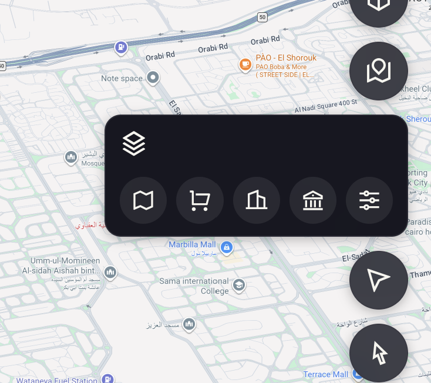
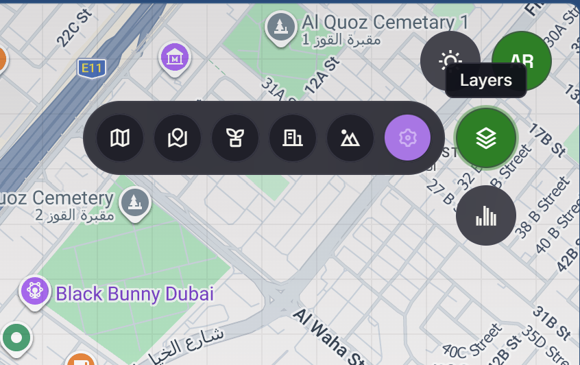
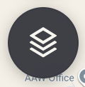
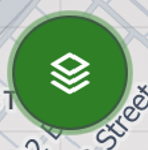

# Ribbon Menu UI/UX Redesign

## Current Menu Behavior

At present, clicking any circular menu button opens a box-style menu. The expanded panel includes the main icon in its header, followed by the available button options.

## Proposed Design

I do not want to continue using the current box-style menu.

Instead, redesign all menus using a **ribbon-style layout**: a rounded rectangle containing the icons for all actions/options available within that menu.

The currently selected option should be visually highlighted using **`#9C62DE`**, matching the appearance shown in Figure 2.

## Ribbon Expansion Direction

The ribbon expands in the direction that keeps it on-screen, based on where the trigger button is positioned:

| Button position | Ribbon expands |
|---|---|
| Right edge of screen | Leftward (horizontal) |
| Left edge of screen | Rightward (horizontal) |
| Top of screen | Downward (vertical) |
| Bottom of screen | Upward (vertical) |

## Main Menu Button States

The main circular menu button should use different colors depending on its state:

- **Collapsed / inactive:** `#45454D`

- **Expanded / active:** `#2E7F26`

The expanded state is applied when the user clicks the main menu button and the ribbon is displayed.

## Exceptions

The **Account menu** is excluded from this redesign and retains its current list-style layout (icon + label rows).

---

*Implemented in SPEC-041 (2026-08-26). See `specs/041-ribbon-menu-redesign/` for design artifacts.*
