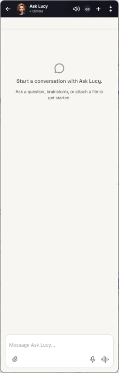
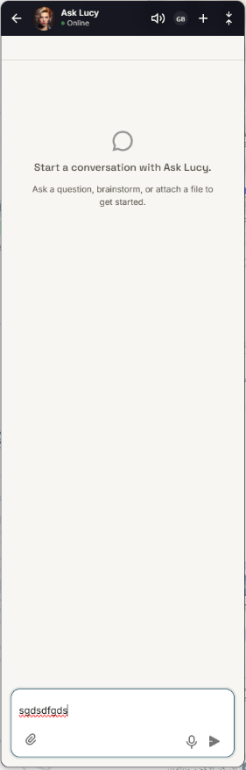
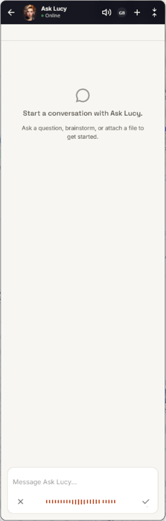
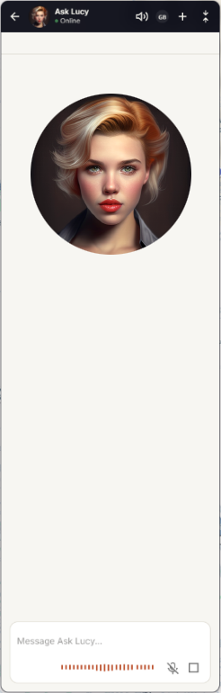
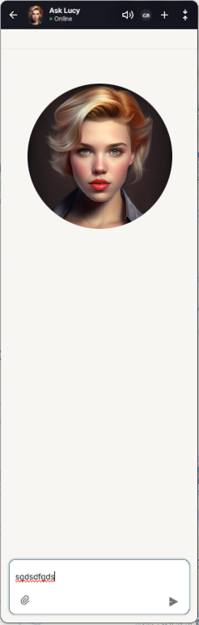
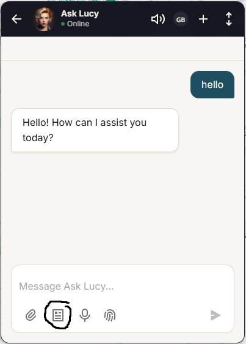
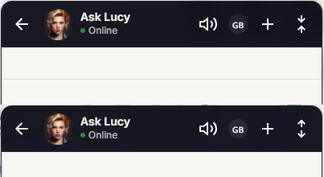
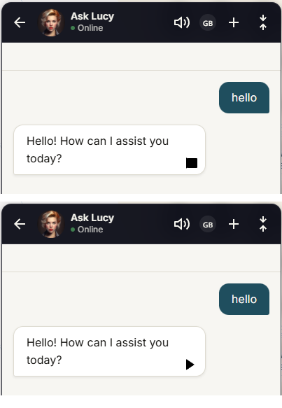
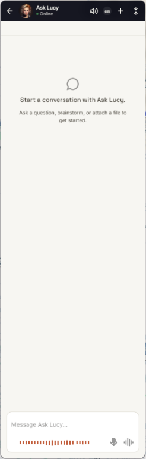

# Functional Requirements — Ask Lucy UI/UX

## 1. Initial Composer View

When the application loads, it should start with the initial composer view (Figure 1).

**Figure 1**

 

- The button with icon **`attachment-2`**: Opens the attachment functionality.
- The button with icon **`mic-line`**: Starts click-to-talk mode.
- The button with icon **`voiceprint-line`** (to replace the `fingerprint-line` icon): Starts continuous conversation mode.

---

When the user starts typing in the text area while in the initial view, the composer changes to the following view (Figure 2):

**Figure 2**

- The button with icon **`send-plane-2-fill`**: Sends the typed message to the chat model.
The send button is dsabled as long as the text area is empty.
Once the message is sent to the agent and the text area is cleared, or the user removed all the text that was typed (i.e. cleared the text area), the view switches again to the initial view (Figure 1).

---

## 2. Click-to-Talk Mode

For both **Figure 1** and **Figure 2**, clicking the microphone starts click-to-talk recording mode and the composer view should display the following (Figure 3):

**Figure 3**

- The button with icon **`close-line`**: Ends and discards the recording, returning to the initial view (**Figure 1**).
- The button with icon **`check-line`**: Finishes the recording and sends it for transcription. The transcribed text is added to the text area after any existing text, then the view returns to the initial view.

---

## 3. Continuous-Conversation Mode

In **Figure 1**, clicking **`voiceprint-line`** starts continuous conversation mode and the view should be changes to this(Figure 4):

**Figure 4**

- The button with icon **`mic-off-line`**: Mutes or unmutes the user during the conversation.
- The button with icon **`stop-line`**: Exits continuous conversation and returns to the initial view (**Figure 1**).
The chat window should display Lucy's picture in circle during this mode only.

While continuous conversation is active, the user can still type in the text area while the agent continues listening, and the composer view chaanges to the following( Figure 5):

**Figure 5**

- The button with icon **`send-plane-2-fill`**: Adds the typed message to the chat conversation sequence and returns to the previous continuous-conversation view (**Figure 4**).

If the user deletes the entire typed message, the composer returns to the empty continuous-conversation view.

**Figure 6**

---
## 4. Saved Prompts

The button with "article-line" icon, saved prompts button should not appear in any composer view or interaction mode.

**Figure 7**

## 5. Composer Height Controls

The change-height controls should use:

- The button with icon **`expand-diagonal-line`** (to replace `expand-vertical-line`): Increases the composer height.
- The button with icon **`collapse-diagonal-line`** (to replace `collapse-vertical-fill`): Reduces the composer height.

**Figure 7**

## 6. Replay Lucy's Response

A replay and stop buttons should appear in the lower-right corner of Lucy's reply alternatively, see Figure 8.

- The button with icon **`play-fill`**: Replays Lucy's response sound when it is not muted.
- The replay action is disabled while Lucy is currently speaking or she is muted.
- The user cannot replay multiple replies at the same time.
- When replay is active, the button changes to the button with icon **`stop-fill`** so the user can stop playback.
- Pressing replay again after stopping starts the response again from the beginning (not resuming).

**Figure 8**

---

## 7. Hold-to-talk mode
When the user is in the initial view and hold the mic button (i.e. keep finger on the button on touch screen devices or left mouse button is down in windows desktop) the view changes to the following view (Figure 9):

**Figure 9**

While the user is pressing the button the icon will be "mic-fill" and the recording starts and continue until the user releases the button (i.e. remove finger or mouse up) then the recording gets transcribed and the view switches to Figure 2.
If the user sends the text and the text area becomes empty, or the user cleared the text area, then switch back to the initial view.