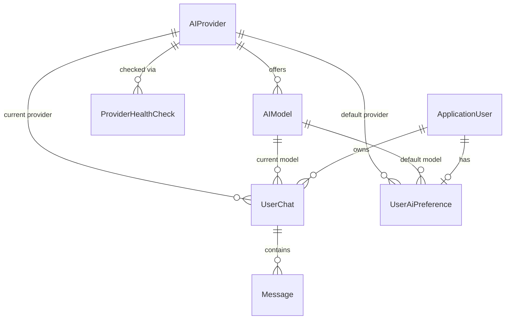

# Phase 1 Data Model: Multi-Provider AI Engine

All new entities live in `AskLucy.Domain/Ai/`, configured in `AskLucy.Persistence/
Configurations/`, per constitution §3 (Domain purity — no EF Core attributes on Domain
types; all mapping via Fluent API). Surrogate keys are `Guid` v7 (`Guid.CreateVersion7()`),
matching every existing entity (`UserChat`, `Message`). Audit columns
(`CreatedAtUtc`/`CreatedBy`/`ModifiedAtUtc`/`ModifiedBy`/`DeletedAtUtc`/`DeletedBy`) come
from the shared `BaseEntity` + `AuditSaveChangesInterceptor`, exactly as on every existing
entity — not repeated below per-entity except where an entity deliberately omits soft
delete.

## New Entities

### AIProvider

Represents one AI vendor the platform can call (OpenAI, Anthropic, Google Gemini,
OpenRouter, and any future vendor). One row per vendor, seeded at migration time.

| Field | Type | Notes |
|---|---|---|
| `Id` | `Guid` | PK |
| `ProviderKey` | `string` (max 50) | Stable machine key used for keyed-DI resolution (research.md Decision 3) — e.g. `"openai"`, `"anthropic"`, `"google-gemini"`, `"openrouter"`. Unique, immutable once seeded. |
| `DisplayName` | `string` (max 100) | e.g. "OpenAI" — shown to users/admins (FR-005). |
| `IsEnabled` | `bool` | Admin-controlled (FR-003). Defaults `false` until an admin configures a credential and enables it. |
| `CredentialCiphertext` | `string?` (nvarchar(max)) | Data-Protection-encrypted API key (research.md Decision 4). Never serialized into any DTO — repository-only field, excluded from every query projection except the one used to build the outbound HTTP call. |
| `CredentialLastRotatedAtUtc` | `DateTime?` | Surfaced to admins instead of the credential itself (FR-004). |
| `DefaultModelId` | `Guid?` | FK → `AIModel.Id`. The provider's suggested default model, used when a platform-wide default is needed (spec Assumption: "a platform-wide default provider/model exists"). |
| `HealthStatus` | `enum` (`Unknown`, `Healthy`, `Unhealthy`) | Denormalized "latest known" status for fast reads; the authoritative history lives in `ProviderHealthCheck`. Updated by `ProviderHealthCheckHostedService` (research.md Decision 7). |
| `HealthStatusCheckedAtUtc` | `DateTime?` | Timestamp of the check that produced `HealthStatus` (FR-027). |

**Validation rules**: `ProviderKey` required, unique, immutable after creation.
`DisplayName` required. `IsEnabled = true` requires a non-null `CredentialCiphertext`
(FR-003/FR-004 — an administrator cannot enable a provider with no credential).

**Relationships**: One `AIProvider` → many `AIModel`. One `AIProvider` → many
`ProviderHealthCheck`. Referenced by `UserChat.ProviderId`, `Message.Provider` (string, kept
as-is for historical attribution — see "Modified Entities" below), `UserAiPreference.
DefaultProviderId`.

**State transitions**: `IsEnabled` toggled only by an administrator (FR-003). Disabling a
provider does not cascade to its models' own `Status` — a disabled provider's models are
already unselectable transitively (FR-007 reads "enabled provider AND available model"), so
no additional state sync is required on disable.

---

### AIModel

Represents one selectable model offered by a provider (FR-005/FR-006).

| Field | Type | Notes |
|---|---|---|
| `Id` | `Guid` | PK |
| `ProviderId` | `Guid` | FK → `AIProvider.Id`, required, indexed. |
| `ModelKey` | `string` (max 100) | The vendor's own model identifier (e.g. `"gpt-4.1"`, `"claude-opus-4"`), used in the actual API call. Unique per `ProviderId`. |
| `DisplayName` | `string` (max 150) | User-facing name (FR-005). |
| `ContextWindowTokens` | `int` | FR-005. |
| `MaxOutputTokens` | `int` | FR-005. |
| `SupportsStreaming` | `bool` | FR-005 capability flag. |
| `SupportsVision` | `bool` | ” |
| `SupportsFunctionCalling` | `bool` | ” |
| `SupportsJsonMode` | `bool` | ” |
| `SupportsReasoning` | `bool` | ” |
| `SupportsEmbeddings` | `bool` | ” |
| `SupportsImageInput` | `bool` | ” |
| `SupportsImageOutput` | `bool` | ” |
| `SupportsAudio` | `bool` | ” |
| `Status` | `enum` (`Available`, `Deprecated`, `Unavailable`) | FR-006. `Deprecated` and `Unavailable` are both non-selectable (Clarifications Session 2026-07-30, Q2) — see State transitions below. |
| `ReleaseDate` | `DateOnly?` | FR-005. |
| `InputPricePerMillionTokensUsd` | `decimal(18,6)?` | Owned value object field (`ModelPricing`) — research.md Decision 2. Null = pricing unknown (FR-022's "clearly indicate when cost cannot be determined"). |
| `OutputPricePerMillionTokensUsd` | `decimal(18,6)?` | ” |

**Validation rules**: `ModelKey` + `ProviderId` unique together. `ContextWindowTokens`/
`MaxOutputTokens` > 0. A generation-parameter request MUST be rejected server-side if it
references a capability the selected model's flags don't support (FR-015) — enforced in the
`SendChatMessageCommandValidator`/`CompareModelsCommandValidator`, not on the entity itself
(keeps the entity a plain data holder; validation is an Application-layer concern per
constitution §3).

**Relationships**: Many `AIModel` → one `AIProvider`. Referenced by `UserChat.ModelId`,
`Message.Model` (string, historical), `UserAiPreference.DefaultModelId`.

**State transitions**:
```
Available ──(admin marks deprecated)──> Deprecated
Available ──(admin marks unavailable)──> Unavailable
Deprecated ──(admin marks unavailable)──> Unavailable
Deprecated ──(admin reinstates)──> Available
Unavailable ──(admin reinstates)──> Available
```
`Deprecated` and `Unavailable` behave identically for selectability (FR-007); they differ
only as an admin-facing label (FR-006) — `Deprecated` communicates "planned phase-out,"
`Unavailable` communicates "non-functional or intentionally disabled right now."

---

### ProviderHealthCheck

Append-only history of provider health-check outcomes (FR-027, User Story 6).

| Field | Type | Notes |
|---|---|---|
| `Id` | `Guid` | PK |
| `ProviderId` | `Guid` | FK → `AIProvider.Id`, required, indexed together with `CheckedAtUtc` for "latest per provider" queries. |
| `CheckedAtUtc` | `DateTime` | Required. |
| `IsHealthy` | `bool` | Required. |
| `Detail` | `string?` (max 500) | Error summary when unhealthy (e.g., "401 Unauthorized", "timeout after 5s") — never the raw provider exception message verbatim if it could contain the credential (constitution §14, no secrets in logs/records). |

**Validation rules**: None beyond required fields — this is a log, not a user-editable
entity.

**Relationships**: Many `ProviderHealthCheck` → one `AIProvider`.

**Lifecycle note**: No soft delete (`DeletedAtUtc`) on this entity — it's an append-only
operational log, not user-facing data subject to the platform's soft-delete/GDPR-erasure
pattern (constitution §5). A retention/pruning job is out of scope for this spec (no FR
requires it); flag as a future operational concern, not a blocker.

---

### UserAiPreference

A user's personal AI defaults (FR-017, FR-019, User Story 3).

| Field | Type | Notes |
|---|---|---|
| `Id` | `Guid` | PK |
| `UserId` | `string` | FK → `AspNetUsers.Id` (matches `UserChat.UserId`'s existing string-typed convention, since `ApplicationUser`'s key is Identity's default `string`). Unique — one row per user. |
| `DefaultProviderId` | `Guid?` | FK → `AIProvider.Id`. Null until the user sets one (falls back to platform default per Decision 8/Assumption). |
| `DefaultModelId` | `Guid?` | FK → `AIModel.Id`. |
| `DefaultGenerationParametersJson` | `string?` | Same JSON-blob shape as `Message.GenerationParametersJson`/`UserChat.GenerationParametersJson` (FR-019). |

**Validation rules**: `DefaultModelId`, if set, must belong to `DefaultProviderId` (cross-
field check in the Application-layer validator, not a DB constraint — consistent with how
`SendChatMessageCommandValidator` already validates request shape).

**Relationships**: One `ApplicationUser` → zero-or-one `UserAiPreference` (created lazily on
first save, not at registration — avoids an empty row for every user who never customizes
defaults).

---

## Modified Entities

### `Message` (existing — `AskLucy.Domain/Chats/Message.cs`)

New nullable columns, additive migration only (no existing column changes):

| Field | Type | Notes |
|---|---|---|
| `CachedTokenCount` | `int?` | FR-020 — populated only when the provider reports it. |
| `ReasoningTokenCount` | `int?` | FR-020 — populated only for reasoning-capable models. |
| `LatencyMs` | `int?` | FR-020. |
| `EstimatedCostUsd` | `decimal(18,6)?` | FR-020/FR-022. Null (not zero) when pricing is unavailable — FR-022 explicitly forbids a misleading zero. |
| `ComparisonGroupId` | `Guid?` | Non-null only for assistant messages produced by a model-comparison call (User Story 7) — groups the N candidate responses to one comparison. Null for ordinary chat turns. |
| `IsIncludedInContext` | `bool` | Default `true` for ordinary messages. For comparison-candidate messages, decided once at creation time (contracts/chat.md's `/compare/{id}/actions/continue`) — `true` only for the candidate the user chose, `false` for the rest; never flipped after insert (`Message` stays append-only/immutable — see class doc comment). Context-assembly (building the message list sent to the provider) filters on this flag; history display does not. |

`Provider`/`Model` (existing `string?` columns, added in SPEC-002) are **kept as free-text**,
not converted to `AIProvider`/`AIModel` foreign keys. This is deliberate: FR-011 requires
historical attribution to survive a provider/model being disabled, deprecated, **or removed
from the catalog entirely** — a FK would either block deletion or null out on cascade,
destroying the historical record. A denormalized string snapshot at write-time is the
correct shape for an immutable, append-only audit trail (`Message` is already documented as
append-only in its own class doc comment).

### `UserChat` (existing — `AskLucy.Domain/Chats/UserChat.cs`)

New nullable columns:

| Field | Type | Notes |
|---|---|---|
| `ProviderId` | `Guid?` | FK → `AIProvider.Id`. The conversation's *current* provider (FR-008/FR-009) — unlike `Message.Provider`, this is a live FK because it represents "what happens next," not history, and must reflect a disable/removal (FR-018's fallback behavior needs to detect staleness). |
| `ModelId` | `Guid?` | FK → `AIModel.Id`, same reasoning. |
| `GenerationParametersJson` | `string?` | Conversation-level generation parameter overrides (FR-014), inherited by new messages unless overridden per-send. |

A new domain method `UserChat.SetModelSelection(Guid providerId, Guid modelId, string?
generationParametersJson, string actor)` follows the existing mutation pattern (`Rename`,
`Archive`, etc. — validates, mutates, bumps `ModifiedAtUtc`/`ModifiedBy`).

---

## Relationships Diagram



`Message.Provider`/`Message.Model` are intentionally **not** drawn as FKs above — see
"Modified Entities" rationale.

## Migrations Required

One additive EF Core migration (`AddMultiProviderAiEngine`), containing:
1. New tables: `AIProviders`, `AIModels`, `ProviderHealthChecks`, `UserAiPreferences`.
2. New nullable columns on `Messages` and `UserChats` (see above).
3. `HasData()` seed for `AIProviders` (4 rows, all `IsEnabled = false` until an admin
   configures credentials) and `AIModels` (research.md Decision 5's baseline catalog).
4. Indexes: `AIModels(ProviderId, ModelKey)` unique; `ProviderHealthChecks(ProviderId,
   CheckedAtUtc)`; `UserAiPreferences(UserId)` unique; `UserChats(ProviderId)`,
   `UserChats(ModelId)` (FK indexes, per constitution §5 "every FK is indexed").

No destructive changes — this migration has a working `Down()` per constitution §5.
