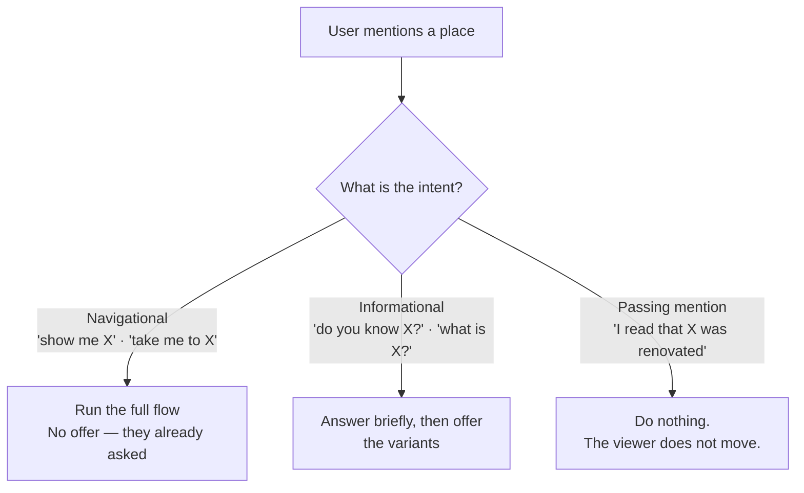

# Contract: Capability Flow

**Feature**: 045-conversational-agent-runtime | **Layer**: `AskLucy.Application/Conversations/Flows`

A **flow** is a named, ordered sequence of capabilities that runs as one job because its steps are logically dependent. Satisfies FR-050 – FR-061. See research.md D17 for why this is not the specs/022 workflow engine.

---

## Interface

```csharp
namespace AskLucy.Application.Conversations.Flows;

/// <summary>
/// A declared, ordered sequence of capability steps run as a single job (FR-050). Registered in
/// DI like a capability: adding a flow is a registration, never a change to the orchestrator.
/// Appears in the Tier 1 index alongside standalone capabilities, so the deciding model may
/// select a whole flow as readily as a single capability.
/// </summary>
public interface IConversationFlow
{
    string Key { get; }

    /// <summary>What the whole job achieves, as one outcome — not a list of its steps.</summary>
    string Description { get; }

    /// <summary>When this flow is the right choice. Same authoring rules as a capability's WhenToUse.</summary>
    string WhenToUse { get; }

    string ArgumentHint { get; }

    /// <summary>Whether this flow can run at all against the current turn state.</summary>
    bool IsAvailable(TurnContext context);

    IReadOnlyList<FlowStep> Steps { get; }

    /// <summary>
    /// Named contiguous prefixes of <see cref="Steps"/>, offered as distinct choices when the
    /// turn's intent was informational (FR-051b, research.md D18). A variant is a whole outcome
    /// the user can want; a step is machinery they should not have to assemble.
    /// </summary>
    IReadOnlyList<FlowVariant> Variants { get; }
}

/// <summary>One offerable way to run a flow: its first N steps, under a user-facing name.</summary>
public sealed record FlowVariant(
    string Key,
    string Label,
    string OfferDescription,
    int ThroughStepIndex);

/// <summary>One step of a flow. Ordered; each depends on the step before it (FR-055).</summary>
public sealed record FlowStep(
    string CapabilityKey,

    /// <summary>Said before this step starts (FR-052). "Now focusing the viewer on it."</summary>
    string AnnouncementTemplate,

    /// <summary>
    /// Builds this step's arguments from the flow's input and the previous step's output —
    /// simple binding, not an expression language (research.md D17). Returning null means the
    /// step cannot proceed and is treated per <see cref="IsRequired"/>.
    /// </summary>
    Func<FlowStepContext, JsonDocument?> BindArguments,

    /// <summary>
    /// True when this step's work is already done for the current context, so it is skipped with
    /// a brief note rather than repeated (FR-057). The flow continues.
    /// </summary>
    Func<FlowStepContext, bool> IsAlreadySatisfied,

    /// <summary>Short past-tense phrase reporting this step's success — "Location found", "Site focused", "Boundary highlighted". Combined with the next step's announcement into one message (FR-053).</summary>
    string CompletionTemplate,

    /// <summary>
    /// False for a step whose failure should not stop the flow. Every step of the initial
    /// Locate a place flow is required — each genuinely depends on its predecessor.
    /// </summary>
    bool IsRequired = true);

public sealed record FlowStepContext(
    TurnContext Turn,
    JsonDocument FlowInput,
    IReadOnlyList<FlowStepResult> CompletedSteps);
```

---

## The `locate_a_place` flow (FR-051)

> **2026-09-11 — step 2 (`adjust_viewer_focus`) removed.** It was a forced `direction: "in"`
> zoom-in, added to compensate for the viewer's own automatic recentre-on-confirmed-location
> (`ViewerSurface.tsx`) falling back to a wide, fixed default zoom whenever the geocoder's
> viewport/locationType data was silently lost between `ResolveLocationCapability` and the
> client — a bug fixed the same day. Once that data reached the client correctly, step 1's own
> auto-zoom started framing the site correctly on its own, and this step's forced zoom-in then
> stacked an extra zoom-in on top of an already-correct frame — live-tested as "zoomed twice" and
> "too tight to see the boundary while rotating." `AdjustViewerFocusCapability` itself is
> untouched and still reachable directly for an explicit "zoom in"/"zoom out" request; only this
> flow's own forced invocation of it is gone. The table, variants, and every example below reflect
> the resulting two-step flow.

| # | Capability | Announcement | Completion | Binds from | Skipped when | Duration |
|---|---|---|---|---|---|---|
| 1 | `resolve_location` | "Looking for {place}." | "Location found" | the place name in the request | — | Noticeable |
| 2 | `resolve_site_boundary` | "Now highlighting the boundary." | "Boundary highlighted — {area}" | step 1's confirmed location | a boundary for that site is already drawn | **Long** |

**Index entry** (Tier 1 — what the deciding model sees):

```text
locate_a_place
  Description:  Finds a named real-world place, focuses the map viewer on it, and outlines
                the site boundary — one job, two steps.
  WhenToUse:    Use when the user asks to see, find, locate or navigate to a named place,
                site, park, building or address they want shown on the map.
  ArgumentHint: the place name
```

Note the description states the **outcome**, not the mechanics. The model chooses a job, not a pipeline.

### Variants (FR-051b)

| Key | Label | Runs | Offer description |
|---|---|---|---|
| `focus` | Focus the viewer on it | step 1 | "Find it and centre the map on it." |
| `full` | Focus and outline the site | steps 1–2 | "Find it, centre the map, and outline the site boundary." |

Individual steps are **never offerable** (FR-060) — variants are. Offering "outline the boundary" as a standalone row would let the user pick a step that cannot run without step 1, and would make them assemble a job they should be able to want as a whole.

### Run automatically, or offer? (FR-051a, research.md D18)

The decide step classifies intent toward the mentioned place, and that alone determines which happens:



Borderline cases resolve to **informational**. Offering when Lucy should have acted costs one click; acting when she should have offered moves the user's viewer uninvited and spends thirty seconds doing it.

An accepted variant runs from step 1 with identical narration (FR-051c) — the informational answer did not require resolving the place, so the geocode happens now.

**Worked example, informational intent.** Note that the offer is **not** limited to this flow's variants — it mixes every kind of logically related next step (FR-021a):

```text
User:  Do you know Al Safa Park 2?
Lucy:  Yes — it's a public park in the Al Safa district of Dubai.

       What would you like to do?
       ○ Focus the viewer on it — Find it and centre the map on it.        ← flow variant
       ○ Focus and outline the site — Find it, centre the map, and         ← flow variant
         outline the site boundary.
       ○ Give you more information about it — More detail on the park       ← conversational
         itself.                                                             follow-up
       ○ Nothing for now                                                    ← decline
```

The third row runs no capability at all — Lucy simply answers in words. It is **composed for this situation** rather than picked from a list (FR-021b), and selecting it can never reach a capability, which is what keeps it safe (FR-021c). No "Something else" row is needed: the composer is live throughout.

---

## Narration cadence

**Every step is announced, uniformly** (FR-052). Each message after the first carries two things: the completion of the step that just finished, and the announcement of the step now starting (FR-053). An N-step flow produces N+1 messages.

```text
"Looking for Al Safa Park 2."                            ← step 1 announced
   [progress: Looking for Al Safa Park 2]
"Location found. Now highlighting the boundary."         ← step 1 done + step 2 announced
   [progress: Highlighting the boundary]
"Boundary highlighted — about 4.2 hectares, medium       ← step 2 done; flow complete
 confidence from OpenStreetMap."
```

Pairing each completion with the next announcement is what makes uniformity affordable: separate "done" and "starting" messages would produce 2N, and a sub-second step would get two messages of its own about work already finished. Combined, every step is named exactly once as it starts and once as it ends, in three messages rather than five.

Each message is its own chat message (FR-004), so each is spoken as it arrives rather than at the end (FR-043).

---

## Failure and interruption

| Situation | Behaviour | What the user reads |
|---|---|---|
| Step 1 fails (place not found) | Flow stops. Step 2 not attempted. | "I couldn't find a place matching that name." |
| Step 2 fails or times out | Flow ends. Step 1 stands. | "I couldn't work out the site boundary." |
| A step is already satisfied | Skipped with a brief note; flow continues (FR-057). | "The site is already outlined, so I've left it as it is." |
| Turn budget reached mid-flow | Flow stops at the current step (FR-059 → FR-056). | "I've stopped there — this was taking longer than expected." |
| User interrupts | Flow stops at the current step; completed steps stay; recorded interrupted (FR-058). | On reload: the completed steps, marked interrupted. |
| Request scopes the flow | Only requested steps run (FR-058). | "just find it, don't outline it" runs step 1 alone. |

**The rule underneath all of these** (FR-056, research.md D19): a stopped flow names **the cause only**. It does not add "…so I haven't focused the viewer or outlined anything" — a dependent sequence halting at a failure is self-evident, and saying it reads as padding. The unattempted steps and their reason go into the record instead, where they answer "why was the boundary never drawn?" without costing the user a sentence.

---

## Record

A flow produces the same record as any other turn (FR-061): one `AgentExecutionStep` per flow step, including **skipped** and **not-attempted** ones with their reason, so the audit answers "why was the boundary never drawn?" without inference.

---

## Testing contract

1. **Happy path, navigational intent** — "show me X" runs both steps in order; each announced before it starts and reported when it finishes; the confirmed location is passed forward, never re-geocoded; **no offer** follows.
1a. **Informational intent** — "do you know X?" answers in text, runs no step, moves the viewer not at all, and offers both variants.
1b. **Passing mention** — "I read that X was renovated" runs nothing and offers nothing.
1c. **Accepted variant** — selecting *focus only* runs step 1 and stops; selecting *focus and outline* runs both steps; both narrate identically to the navigational path.
2. **Failure at each step position** — first or last: the flow stops, the failure is named, any remaining step is reported as not attempted, and earlier results stay valid.
3. **Already-satisfied skip** — a second run for the same place skips the satisfied step with a note and completes fast.
4. **Scoped request** — "just find it" runs step 1 only.
5. **Interruption** — cancelling mid-flow leaves completed steps in history and records the flow interrupted, distinct from failed.
6. **Budget** — a flow that would exceed the per-turn budget stops and explains rather than running over.
7. **No independent offer** — after the flow completes, `resolve_site_boundary` does not appear in the offer (FR-060).
8. **Record completeness** — every step, including skipped and unattempted, appears in the execution record with a reason.
